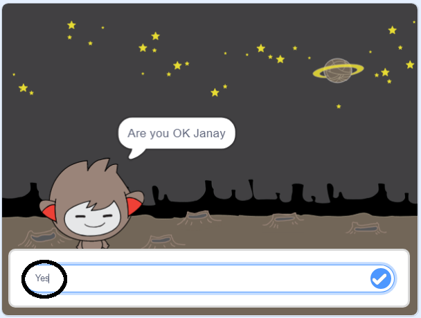

## निर्णय लेना

आप अपने चैटबोट को यह तय करने के लिए प्रोग्राम कर सकते हैं कि उसे प्राप्त जवाबों के आधार पर क्या करना है।

सबसे पहले, आप अपने चैटबॉट से एक प्रश्न पुछवाने जा रहे हैं जिसका उत्तर "yes" या "no" में दिया जा सकता है।

\--- task \---

अपने चैटबोट का कोड बदलें। आपके चैटबोट को `name`{:class="block3variables"} वेरियबल का उपयोग करके "Are you OK name" सवाल पूछना चाहिए। तो यह जवाब देना चाहिए "That's great to hear!" `if`{:class="block3control"} इसे प्राप्त होने वाला जवाब "yes" है, लेकिन यदि जवाब "no" है तो कुछ भी न कहे।




```blocks3
when this sprite clicked
ask [What's your name?] and wait
set [name v] to (answer)
say (join [Hi ] (name)) for (2) seconds
+ask (join [Are you OK ] (name)) and wait
+if <(answer) = [yes]> then 
  say [That's great to hear!] for (2) seconds
end
```

अपने नए कोड को ठीक से जांचने के लिए, आपको इसको जांचना चाहिए **दो बार**: एक बार "yes" और एक बार "no" के साथ।

\--- /task \---

फिलहाल, आपका चैटबॉट "no" के जवाब में कुछ नहीं कहता है।

\--- task \---

अपने चैटबोट का कोड बदलें ताकि यह जवाब दे "Oh no!" अगर उसे "Are you OK name" के उत्तर के रूप में "no" प्राप्त होता है।

`if, then`{:class="block3control"} ब्लॉक को `if, then, else`{:class="block3control"} ब्लॉक से बदलें, और कोड शामिल करें ताकि चैटबोट `कहें "Oh no!"`{:class="block3looks"}।


```blocks3
when this sprite clicked
ask [What's your name?] and wait
set [name v] to (answer)
say (join [Hi ] (name)) for (2) seconds
ask (join [Are you OK ] (name)) and wait

+ if <(answer) = [yes]> then 
  say [That's great to hear!] for (2) seconds
else 
+  say [Oh no!] for (2) seconds
end
```

\--- /task \---

\--- task \---

अपने कोड का परीक्षण करें। जब आप "no" जवाब देते हैं और जब आप "yes" जवाब देते हैं तो आपको एक अलग प्रतिक्रिया मिलनी चाहिए: आपके चैटबॉट को "That’s great to hear!" जब आप "yes" उत्तर देते हैं (जो अक्षर संवेदनशील नहीं है), और "Oh no!" के साथ उत्तर दें जब आप **उत्तर कुछ और देते हैं**।


\--- /task \---

आप किसी भी कोड को `if, then, else`{:class="block3control"} ब्लॉक के अंदर रख सकते हैं, न कि सिर्फ अपने चैटबोट को बुलवाने के लिए कोड!

यदि आप अपने चैटबोट के **Costumes** टैब पर क्लिक करेंगे, आप देखेंगे कि एक से अधिक पोशाकें है।


\--- task \---

अपने चैटबॉट का कोड बदलें ताकि जब आप अपना जवाब लिखें तो चैटबॉट पोशाकें बदले।


`if, then, else`{:class="block3control"} ब्लॉक के अंदर का कोड बदलें `switch costume`{:class="block3looks"} के लिए।


```blocks3
when this sprite clicked
ask [What's your name?] and wait
set [name v] to (answer)
say (join [Hi ] (name)) for (2) seconds
ask (join [Are you OK ] (name)) and wait
if <(answer) = [yes]> then 

+  switch costume to (nano-c v)
  say [That's great to hear!] for (2) seconds
else 
+  switch costume to (nano-d v)
  say [Oh no!] for (2) seconds
end
```

अपना कोड जांचें और सेव करें। आपको अपने जवाब के आधार पर अपने चैटबॉट का चेहरा बदलता दिखना चाहिए।

\--- /task \---

क्या आपने देखा है कि, आपके चैटबॉट की पोशाक बदल जाने के बाद, यह वैसा ही रहता है और पहले जैसा नहीं होता है?

आप इसे आजमा सकते हैं: अपना कोड चलाएं और "no" का उत्तर दें ताकि आपके चैटबॉट का चेहरा दुखी नज़र आए। फिर अपना कोड फिर से चलाएं और ध्यान दें कि आपका चैटबॉट आपका नाम पूछने से पहले खुश दिखने के लिए वापस नहीं बदलता है।


\--- task \---

इस समस्या को ठीक करने के लिए, चैटबॉट के कोड को `switch costume`{:class="block3looks"} में जोड़ें शुरू में जब `when the sprite is clicked`{:class="block3events"}।


```blocks3
when this sprite clicked

+ switch costume to (nano-a v)
ask [What's your name?] and wait
```


\--- /task \---