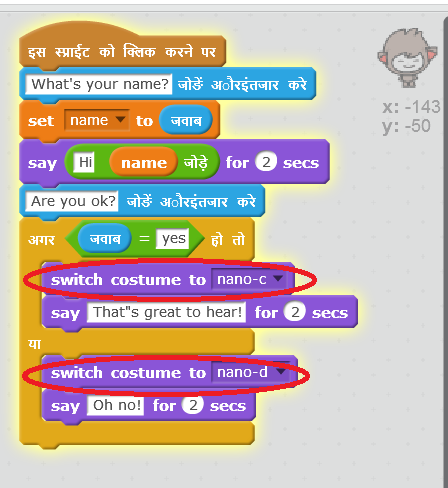

## चरण 3: निर्णय लेना

आप अपने चैटबॉट को अपने प्रश्नों के उत्तर के आधार पर क्या कहना है या क्या करना है यह तय करने के लिए प्रोग्राम कर सकते हैं।

\--- task \---

क्या आप चैटबॉट को "Are you OK?" पूछने के लिए तैयार कर सकते हैं, और उत्तर "That's great to hear!" बोलने के लिए कोड कर सकते हैं, **अगर** उपयोगकर्ता का उत्तर केवल "yes" हो?

अपने नए कोड को ठीक से जांचने के लिए, आपको इसको **दो बार** जांचना चाहिए।एक बार "yes" और एक बार "no" के साथ।

अगर आपका उत्तर "yes" है, तो आपके चैटबॉट को "That's great to hear!" जवाब देना चाहिए, परन्तु यदि आप "no" उत्तर देते हैं, तो इसे कुछ नहीं कहना चाहिए।

\--- hints \--- \--- hint \--- आपके चॅटबोट द्वारा "Hi" कहने के बाद, उसे अब "Are you OK?" भी **पूछना** चाहिए। **अगर** आपका उत्तर "yes" है, तो चॅटबोट को "That's great to hear!" **कहना** चाहिए। \--- /hint \--- \--- hint \--- ये वे अतिरिक्त कोड ब्लॉक हैं, जिनकी आपको आवश्यकता होगी:  \--- /hint \--- \--- hint \--- आपका कोड इस प्रकार दखाई देगा:  \--- /hint \--- \--- /hints \---

\--- /task \---

\--- task \---

इस समय अगर आपका उत्तर "no" है, तो आपका चैटबॉट कुछ नहीं कहता। क्या आप अपने चैटबॉट में परिवर्तन कर सकते हैं ताकि यह जवाब दे सके "Oh no!" यदि आप इसके प्रश्न के लिए "no" का जवाब देते हैं?

परीक्षण करें और सहेजें। यदि आप "no" उत्तर देते हैं, तो आपके चैटबॉट को "Oh no" कहना चाहिए। असल में, यदि आप "yes" के अलावा कोई अन्य उत्तर देते हैं, तो यह कहेगा "Oh no!" (`अगर/या` ब्लॉक में **वरना** का अर्थ **अन्यथा**होता है)।

\--- hints \--- \--- hint \--- **यदि** आपका उत्तर "yes" है तो आपके चैटबॉट को अब "That's great to hear!" कहना चाहिए, लेकिन अगर आप कुछ **और** जवाब देते हैं तो इसे "Oh no!" कहना चाहिए। \--- /hint \--- \--- hint \--- ये वे कोड ब्लॉक हैं, जिनकी आपको आवश्यकता होगी:  \--- /hint \--- \--- hint \--- आपका कोड इस प्रकार दखाई देगा:  \--- /hint \--- \--- /hints \---

\--- /task \---

\--- task \---

अपने चैटबॉट को बुलवाने के लिए आप अगर/या<0> ब्लॉक के भीतर, यह कोड ही नहीं बल्कि कोई भी कोड जोड़ सकते हैं। यदि आप अपने चैटबॉट के <strong>Costume</strong> टैब पर क्लिक करें, तो आप देखेंगे कि इसमें एक से अधिक पोशाक हैं।

--- /task ---

--- task ---

क्या आप चैटबॉट की पोशाक को अपने प्रत्युत्तर से मिलाने के लिए बदल सकते हैं?

परीक्षण करें और सहेजें। आपको अपने उत्तर के आधार पर चैटबॉट के चेहरे में बदलाव दिखना चाहिए।

--- hints --- 
--- hint --- 
दिए गए उत्तर के आधार पर आपके चैटबॉट को अब <strong>पोशाक भी बदलनी<0> चाहिए।
--- /hint ---
--- hint ---
ये वे कोड ब्लॉक हैं, जिनकी आपको आवश्यकता होगी: 

--- /hint ---
--- hint ---
आपका कोड इस प्रकार दखाई देगा:

--- /hint ---
--- /hints ---

--- /task ---

--- task ---

क्या आपने देखा है कि आपके चैटबॉट की पोशाक वैसे ही रहती है जैसे आपने पिछली बार बात की थी? क्या आप इस समस्या को ठीक कर सकते हैं?

परीक्षण करें और सहेजें: अपना कोड रन(run) करें और "no" टाइप करें, ताकि आपका चैटबॉट नाखुश दिखाई दे। जब आप अपना कोड पुनः रन करते हैं, तो आपके चैटबॉट को आपका नाम पूछने से पहले फिर से खुशनुमा चेहरे में बदल जाना चाहिए।

--- hints --- 
--- hint --- 
जब <strong>स्प्राइट पर क्लिक</strong> किया जाता है, तो आपके चैटबॉट को पहले खुशनुमा चेहरे की <strong>पोशाक में बदल</strong> जाना चाहिए।
--- /hint ---
--- hint ---
ये वे कोड ब्लॉक हैं, जिनकी आपको आवश्यकता होगी: 

--- /hint ---
--- hint ---
आपका कोड इस प्रकार दखाई देगा:

--- /hint ---
--- /hints ---

--- /task ---

--- challenge ---

<h2>चुनौती: अधिक निर्णय</h2>

अपने चैटबॉट को एक और प्रश्न पूछने के लिए कोड करें - "yes" या "no" उत्तर वाला कुछ। क्या आप चैटबॉट को ऐसा कर सकते हैं कि आपके उत्तर पर प्रत्युत्तर दे?

--- /challenge ---
