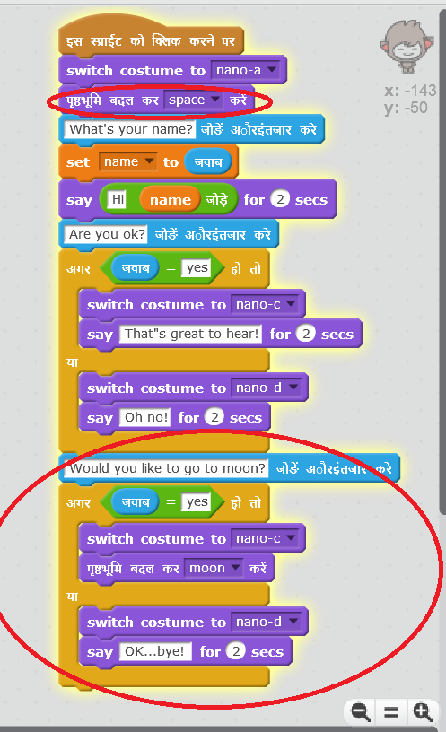

## स्थान बदलना

आप अपने चैटबॉट के स्थान में परिवर्तन करने के लिए उसे कोड भी कर सकते हैं।

+ अपने स्टेज के लिए अन्य बैकड्रॉप शामिल करें, उदाहरण के लिए 'चाँद' बैकड्रॉप।

	

+ आप यह पूछने के लिए अपने चैटबॉट को कोड कर सकते हैं कि "क्या आप चाँद पर जाना चाहेंगे?" और फिर यदि आपका उत्तर "हाँ" है, तो स्थान बदल दें?

    परीक्षण करें और सहेजें। यदि आप "हाँ" उत्तर देते हैं, तो आपके चैटबॉट को स्थान बदना चाहिए। कोई अन्य उत्तर देने की स्थिति में, आपके चैटबॉट को दुखी होकर "ओक...बाय!" कहना चाहिए।

    

--- hints ---
--- hint ---
आपके चैटबॉट को__पूछना__ चाहिए "क्या आप चाँद तक जाना चाहेंगे?"। __अगर__ आपका __उत्तर__ "हाँ" है, तो आपके चैटबॉट को खुश दिखने के लिए __पोशाक बदलनी__ होगी और स्टेज __बैकड्रॉप__ बदलना चाहिए।

यदि आपका उत्तर "नहीं" है, तो चैटबॉट को दुखी दिखाई देने के लिए __पोशाक बदलनी__ होगी और __कहना होगा__ "ओक...बाय!"

__क्लिक किए जाने पर__ आपको सही स्थान पर चैटबॉट को आरंभ करने के लिए भी कोड जोड़ना होगा।
--- /hint ---
--- hint ---
ये वे कोड ब्लॉक हैं, जिनकी आपको उपयोग के लिए आवश्यकता होगी:

--- /hint ---
--- hint ---
आपका कोड कुछ इस प्रकार दिखाई देना चाहिए:

--- /hint ---
--- /hints ---

+ क्या आप अपने चैटबॉट में ऐसा कोड जोड़ सकते हैं कि जब आप इसे अपनी चाँद पर जाने की इच्छा के बारे में बताएँ, तो यह ख़ुशी से कूदने लग जाए?

    परीक्षण करें और सहेजें। यदि आप "हाँ" कहते हैं, तो आपके चैटबॉट को उपर-नीचे कूदना चाहिए। किसी अन्य उत्तर मिलने की स्थिति में आपके चैटबॉट को उपर-नीचे कूदना नहीं चाहिए।

    

--- hints ---
--- hint ---
आपके चैटबॉट को __अपनी__ __y की स्थिति में __ कुछ परिवर्तन करके__कुछ दूर__ छलांग लगानी चाहिए, और फिर कुछ __समय बाद __पहली स्थिति में  आ जाना चाहिए। आप इसे कुछ बार और __दोहराना__ चाह सकते हैं।
--- /hint ---
--- hint ---
ये वे कोड ब्लॉक हैं, जिनकी आपको उपयोग के लिए आवश्यकता होगी:

--- /hint ---
--- hint ---
आपका कोड कुछ इस प्रकार दिखाई देना चाहिए:

--- /hint ---
--- /hints ---
