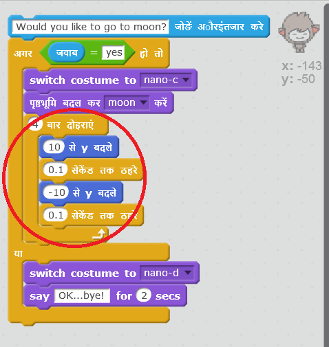

## स्थान बदलना

आप अपने चैटबॉट को अपना स्थान बदलने के लिए भी कोड कर सकते हैं।

\--- task \---

अपने चरण में एक और पृष्ठभूमि(backdrop) जोड़ें, उदाहरण के लिए 'चंद्रमा' पृष्ठभूमि।

\--- /task \---

\--- task \---

क्या आप अपने चैटबॉट को यह पूछने के लिए कोड कर सकते हैं कि "क्या आप चंद्रमा पर जाना चाहते हैं?" और फिर यदि आपका उत्तर "हाँ है, तो स्थान बदल दें?

परीक्षण करें और सहेजें। यदि आप "हाँ" उत्तर देते हैं, तो आपके चैटबॉट को स्थान बदलना चाहिए। कोई अन्य उत्तर देने पर आपके चैटबॉट को दुखी होकर "ओक...बाय!" कहना चाहिए।

\--- hints \--- \--- hint \--- आपके चैटबॉट को **पूछना** चाहिए कि "क्या आप चाँद तक जाना चाहेंगे?"। **अगर** आपका उत्तर "हाँ" है, तो आपके चैटबॉट को खुश दिखने के लिए **पोशाक बदलनी** चाहिए और स्टेज **पृष्ठभूमि** बदलनी चाहिए।

यदि आपका उत्तर "नहीं" है, तो चैटबॉट को दुखी दिखाई देने के लिए **पोशाक बदलनी** होगी और **कहना** होगा "ओक...बाय!"

**क्लिक किए जाने पर** आपको चैटबॉट को सही स्थान पर आरम्भ करने के लिए भी कोड जोड़ना होगा। \--- /hint \--- \--- hint \--- ये वे कोड ब्लॉक हैं, जिनकी आपको आवश्यकता होगी:  \--- /hint \--- \--- hint \--- आपका कोड इस प्रकार दखाई देगा:  \--- /hint \--- \--- /hints \---

\--- /task \---

\--- task \---

क्या आप अपने चैटबॉट में ऐसा कोड जोड़ सकते हैं कि जब आप इसे चाँद पर जाने को बताएँ तो यह ख़ुशी से कूदने लग जाए?

परीक्षण करें और सहेजें। यदि आप "हाँ" कहते हैं, तो आपके चैटबॉट को उपर-नीचे कूदना चाहिए। किसी अन्य उत्तर मिलने पर आपके चैटबॉट को उपर-नीचे कूदना नहीं चाहिए।

\--- hints \--- \--- hint \--- आपके चैटबॉट को थोड़ी सी मात्रा में **y स्थिति** में **परिवर्तन** करके कूदना चाहिए, और फिर छोटी **प्रतीक्षा** के बाद अपनी स्थिति में वापस आ जाना चाहिए। You may want to **repeat** this a few times. \--- /hint \--- \--- hint \--- Here are the code blocks you'll need to use:  \--- /hint \--- \--- hint \--- Here's how your code should look:  \--- /hint \--- \--- /hints \---

\--- /task \---