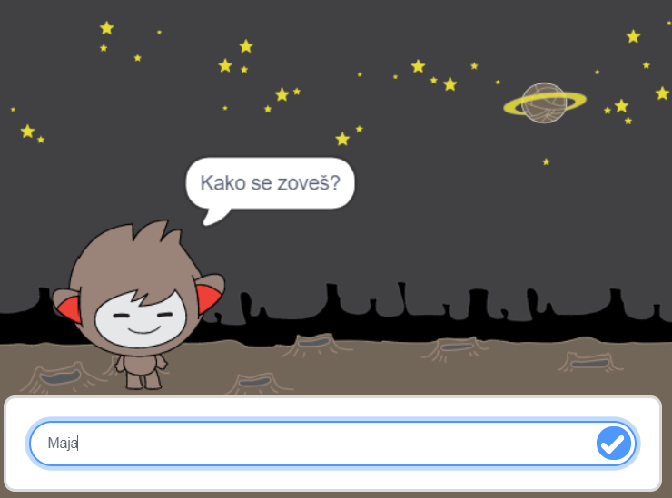

\--- no-print \---

Ovo je **Scratch 3** verzija projekta. Postoji i [Scratch 2 verzija projekta](https://projects.raspberrypi.org/en/projects/chatbot-scratch2).

\--- /no-print \---

## Uvod

Naučit ćeš napraviti program pomoću kojeg će tvoj lik razgovarati s tobom! Takav se program naziva chat robot ili chatbot.

### Napravit ćeš

\--- no-print \---

Klikni na zelenu zastavicu, a zatim klikni na lika robota da započneš razgovor. Kada chatbot postavi pitanje, upiši svoj odgovor u tekstualni okvir na dnu Pozornice. Zatim klikni na kvačicu koja se nalazi desno u okviru (ili pritisni `Enter`) i vidjet ćeš chatbotov odgovor.

  <iframe allowtransparency="true" width="485" height="402" src="https://scratch.mit.edu/projects/embed/248864190/?autostart=false" 
  frameborder="0" scrolling="no"></iframe>

\--- /no-print \---

\--- print-only \---

\--- /print-only \---

## \--- collapse \---

## naslov: Što će vam trebati

### Hardver

- Računalo sposobno za pokretanje Scratch 3 verzije

### Softver

- Scratch 3 ([online](https://rpf.io/scratchon) ili [offline](https://rpf.io/scratchoff) verziju)

### Preuzimanja

- [Ovdje ćeš pronaći datoteke za preuzimanje](http://rpf.io/p/en/chatbot-go).

\--- /collapse \---

## \--- collapse \---

## naslov: Što ćete naučiti

- Use code to join text in Scratch
- Razumijeti da se varijable mogu koristiti za spremanje korisničkih unosa
- Upotrijebite uvjetni odabir da biste odgovorili na korisnikov unos u programu Scratch

\--- /collapse \---

## \--- collapse \---

## title: Dodatne informacije za voditelje kluba

\--- no-print \---

Ako želite ispisati ovaj projekt, koristite [verziju koja je prilagođena za ispis](https://projects.raspberrypi.org/en/projects/chatbot/print){:target="_blank"}.

\--- /no-print \---

[Ovdje](http://rpf.io/p/en/chatbot-get) možete pronaći dovršen projekt.

\--- /collapse \---