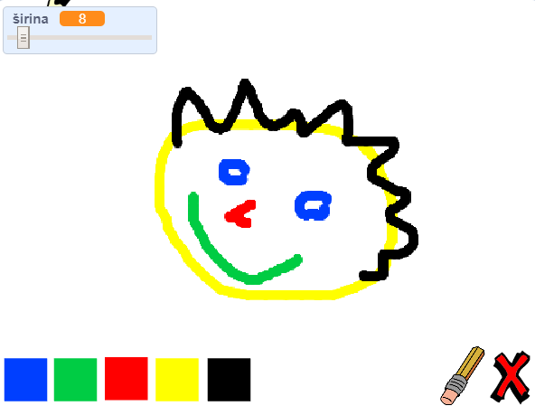

## Što dalje?

Isprobaj projekt [Program za bojanje](https://projects.raspberrypi.org/en/projects/paint-box?utm_source=pathway&utm_medium=whatnext&utm_campaign=projects) u kojem ćeš kreirati vlastiti program za bojanje!

\--- no-print \--- Klikni na zelenu zastavicu za početak. Pomoću miša pomiči olovku, a lijevu tipku miša drži za crtanje. Klikni na boju i promijeni olovku. Klikni na gumicu za brisanje i upotrijebi ju za brisanje nacrtanog. To clear the page, click on the cross.

  <iframe allowtransparency="true" width="485" height="402" src="//scratch.mit.edu/projects/embed/267243161/?autostart=false" frameborder="0" scrolling="no"></iframe>
  

\--- /no-print \---

\--- print-only \--- You will click on the green flag to start, and you'll use the mouse to move the pencil and hold down the left mouse button to draw. Clicking on a colour will change pencil colours, and clicking on the eraser will change to the eraser!

 \--- /print-only \---