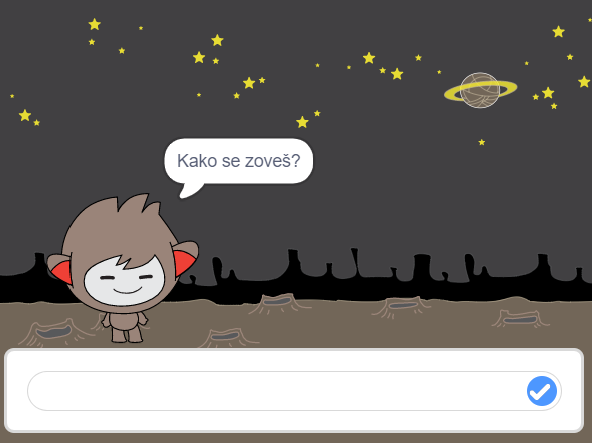
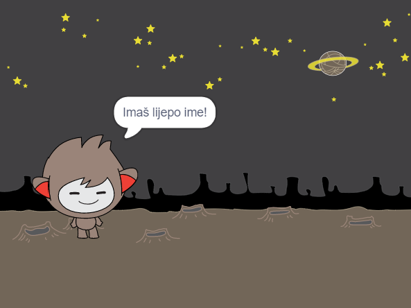

## Robot koji govori

Sad kada imaš robota s osobnošću, programirat ćemo ga da razgovara s tobom.

\--- task \---

Kliknite na lika chatbota i dodaj mu ovaj kôd tako da, `kada klikneš na njega`{:class="block3events"}, pita za `tvoje ime`{:class="block3sensing"}, a zatim `kaže „Imaš lijepo ime!”`{:class="block3looks"}.


```blocks3
Kada je lik kliknut
pitaj [Kako se zoveš?] i čekaj
govori [Imaš lijepo ime!] (2) sekundi
```

\--- /task \---

\--- task \---

Klikni na svog chatbota i testiraj kôd. Kad chatbot zatraži tvoje ime, upiši ga u okvir koji se pojavi na dnu Pozornice, a zatim klikni na plavu kvačicu ili pritisni <kbd>Enter</kbd>.





\--- /task \---

\--- task \---

Trenutačno tvoj chatbot odgovara „Imaš lijepo ime!” svaki put kad odgovoriš. Odgovor chatbota možeš učiniti osobnijim, tako da je odgovor različit svaki put kada se unese drugo ime.

Izmijeni kôd lika chatbota tako da `spojiš`{:class="block3operators"} „Bok” s `odgovorom`{:class="block3sensing"} na pitanje „Kako se zoveš?”, tako da kôd izgleda ovako:


```blocks3
Kada je lik kliknut
pitaj [Kako se zoveš?] i čekaj
govori (spoji [Bok ] (odgovor) :: +) (2) sekundi
```


\--- /task \---

\--- task \---

Spremanjem odgovora u **varijablu**, možeš ga koristiti bilo gdje u projektu.

Kreiraj novu varijablu koja se zove `ime`{:class="block3variables"}.

[[[generic-scratch3-add-variable]]]

\--- /task \---

\--- task \---

Sada izmijeni kôd chatbot lika i postavi varijablu `ime`{:class="block3variables"} na `odgovor`{:class="block3sensing"}:


```blocks3
Kada je lik kliknut
pitaj [Kako se zoveš?] i čekaj

+ postavi [ime v] na (odgovor)
govori (spoji [Bok ] (ime :: + variables)) (2) sekundi
```

Tvoj kôd bi trebao funkcionirati kao i prije. Robot bi trebao pozdravljati koristeći ime koje upišeš.


\--- /task \---

Ponovno testiraj svoj program. Primijeti da je odgovor koji upišeš pohranjen u varijablu `ime`{:class="block3variables"}, a također je prikazan u gornjem lijevom kutu Pozornice. Za uklanjanje odgovora sa Pozornice, otvori kategoriju `Varijable`{:class="block3variables"}. Klikni na kućicu pored varijable `ime`{:class="block3variables"} i odznači ju.