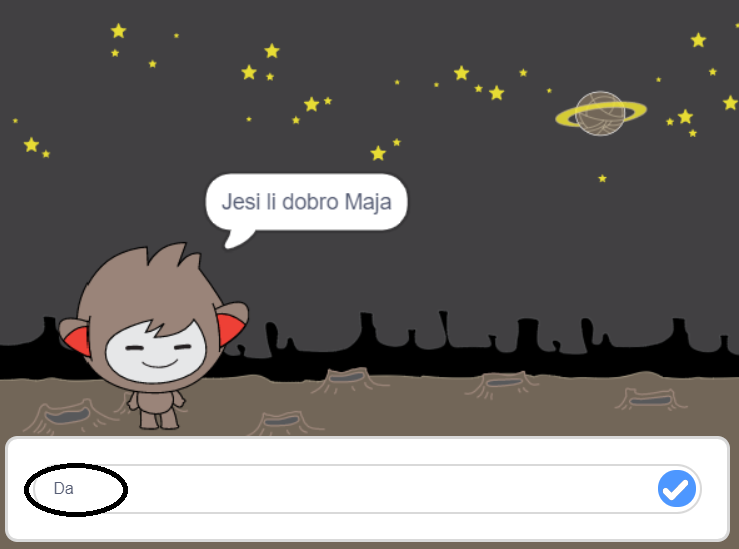
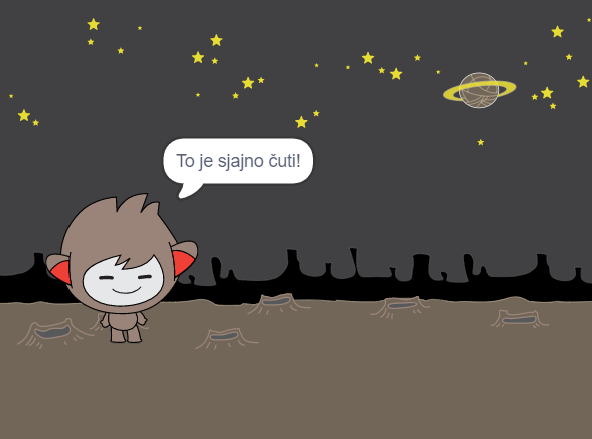
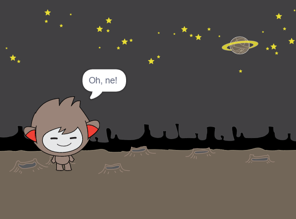
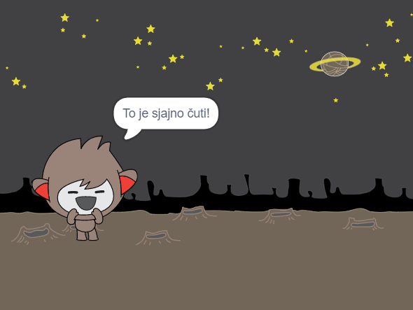
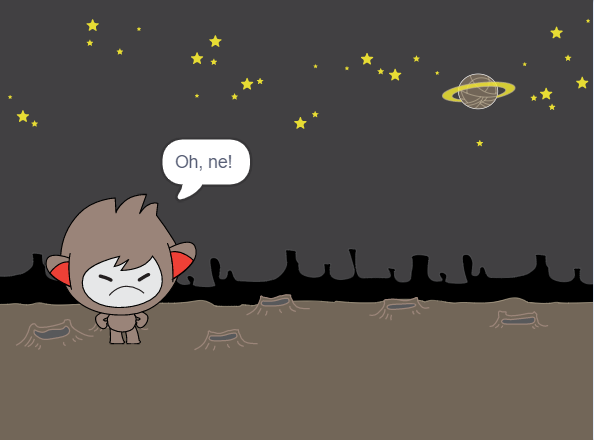
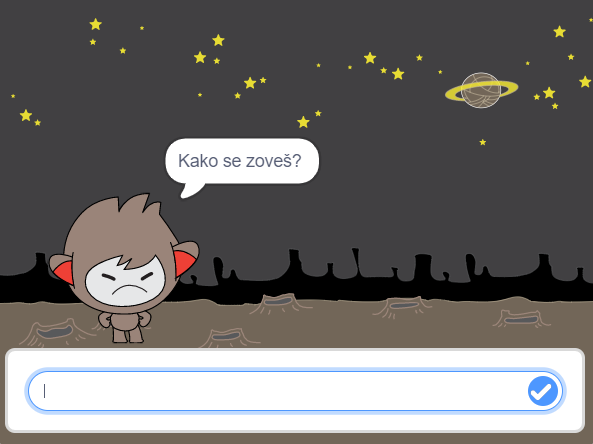
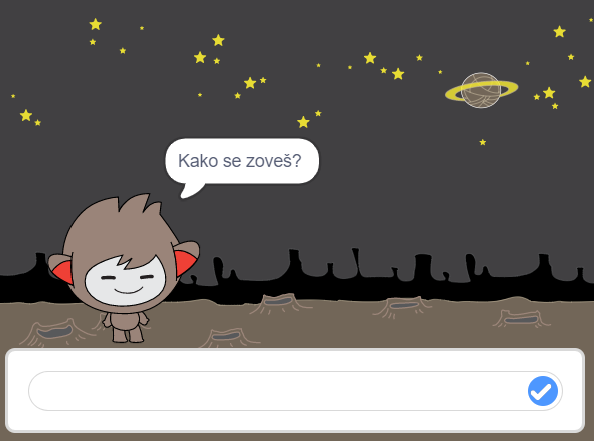

## Donošenje odluka

Možeš programirati svog chatbota da sam odluči što će reći ili napraviti ovisno o tome kakav odgovor dobije.

Prvo ćeš programirati svog chatbota da postavi pitanje na koje je moguće odgovoriti sa „da“ ili „ne“.

--- task ---

Izmijeni kôd svog chatbota. Tvoj chatbot trebao bi postaviti pitanje „Jesi li dobro ime“, koristeći se varijablom `ime`{:class="block3variables"}. Zatim bi trebao odgovoriti „To je sjajno čuti!“ `ako`{:class="block3control"} dobije odgovor „da“, ali ne reći ništa ako je odgovor „ne“.






```blocks3
Kada je lik kliknut
pitaj [Kako se zoveš?] i čekaj
postavi [ime v] na (odgovor)
govori (spoji [Bok ] (ime)) (2) sekundi
+pitaj (spoji [Jesi li dobro ] (ime)) i čekaj
+ako <(odgovor) = [da]> onda 
  govori [To je sjajno čuti!] (2) sekundi
end
```

Provjeri radi li tvoj novi kôd, tako da ga testiraš **dva puta**: jednom s odgovorom „da“ i jednom s odgovorom „ne“.

--- /task ---

Trenutno tvoj chatbot ništa ne kaže kada je odgovor „ne“.

--- task ---

Izmijeni kôd tako da chatbot kaže „Oh, ne!“ ako na pitanje „Jesi li dobro ime“ dobije odgovor „ne“.

Zamijeni blok `ako, onda`{:class="block3control"} sa blokom `ako, onda, inače`{:class="block3control"} i ne zaboravi kôd kako bi chatbot mogao `reći „Oh, ne!“`{:class="block3looks"}.


```blocks3
Kada je lik kliknut
pitaj [Kako se zoveš?] i čekaj
postavi [ime v] na (odgovor)
govori (spoji [Bok ] (ime)) (2) sekundi
pitaj (spoji [Jesi li dobro ] (ime)) i čekaj
+ ako <(odgovor) = [da]> onda 
  govori [To je sjajno čuti!] (2) sekundi
inače 
+  govori [Oh, ne!] (2) sekundi
end
```

--- /task ---

--- task ---

Testiraj svoj kôd. Trebaš dobiti drugačiji odgovor kada odgovoriš sa „ne“ i kad odgovoriš sa „da“. Kada je odgovor „da“, chatbot bi trebao reći „To je sjajno čuti!“ (zapamti da chatbot nije osjetljiv na velika i mala slova). Kada je odgovor **bilo što drugo**,  chatbot bi trebao reći „Oh, ne!“.




--- /task ---

Možeš staviti bilo koji kôd unutar bloka `ako, onda, inače`{:class="block3control"}, a ne samo kôd zbog kojeg će tvoj chatbot pričati!

Ako klikeš na svog chatbota, a zatim na karticu **Kostimi**, vidjet ćeš da chatbot ima više od jednog kostima.


--- task ---

Promijeni kôd svog chatbota tako da chatbot mijenja kostime kad upišeš svoj odgovor.





Promijeni kôd unutar bloka `ako, onda, inače`{:class="block3control"} kako bi chatbot `promijenio kostim`{:class="block3looks"}.


```blocks3
Kada je lik kliknut
pitaj [Kako se zoveš?] i čekaj
postavi [ime v] na (odgovor)
govori (spoji [Bok ] (ime)) (2) sekundi
pitaj (spoji [Jesi li dobro ] (ime)) i čekaj
ako <(odgovor) = [da]> onda 
+  promijeni kostim u (nano-c v)
  govori [To je sjajno čuti!] (2) sekundi
inače 
+  promijeni kostim u (nano-d v)
  govori [Oh, ne!] (2) sekundi
end
```

Testiraj i spremi svoj kôd. Lice tvog chatbota trebalo bi se mijenjati ovisno o tvom odgovoru.

--- /task ---

Primjećuješ li da se, nakon promjene kostima, chatbot ne vraća u kostim u kojem je bio na početku, već ostaje u zadnjem kostimu? 

Pokušaj napraviti ovo: pokreni kôd i odgovori sa „ne“ tako da tvoj chatbot dobije tužan izraz lica. Zatim opet pokreni kôd i primijeti kako chatbot ne vrati sretan izraz lica prije nego li pita za tvoje ime. 



--- task ---

Ovaj problem možeš riješiti tako da chatbotu dodaš kôd za `promjenu kostima`{:class="block3looks"} na početku programa, `kada je lik kliknut`{:class="block3events"}.


```blocks3
Kada je lik kliknut
+ promijeni kostim u (nano-a v)
pitaj [Kako se zoveš?] i čekaj
```



--- /task ---