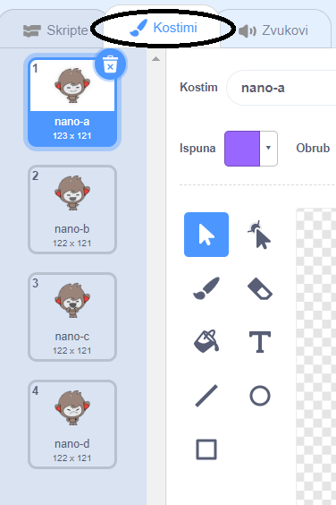

## Donošenje odluka

Možeš programirati svog chatbota da sam odluči što će reći ili napraviti ovisno o tome kakav odgovor dobije.

Prvo ćeš programirati svog chatbota da postavi pitanje na koje je moguće odgovoriti sa „da“ ili „ne“.

\--- task \---

Izmijeni kôd svog chatbota. Tvoj chatbot trebao bi postaviti pitanje „Jesi li dobro ime“, koristeći se varijablom `name`{:class="block3variables"}. Zatim bi trebao odgovoriti „To je sjajno čuti!“ `if`{:class="block3control"} dobije odgovor „da“, ali ne reći ništa ako je odgovor „ne“.


```blocks3
when this sprite clicked
ask [Kako se zoveš?] and wait
set [ime v] to (answer)
say (join [Bok ] (name)) for (2) seconds
+ask (join [Jesi li dobro ] (name)) and wait
+if <(answer) = [yes]> then 
  say [To je sjajno ćuti!] for (2) seconds
end
```

Provjeri radil li tvoj novi kôd, tako da ga testiraš **twice**: jednom s odgovorom „da“ i jednom s odgovorom „ne“.

\--- /task \---

Trenutno tvoj chatbot ništa ne kaže kada je odgovor „ne“.

\--- task \---

Izmijeni kôd tako da chatbot kaže „Oh, ne!“ ako na pitanje „Jesi li dobro ime“ dobije odgovor „ne“.

Zamijeni blok `if, then`{:class="block3control"} sa blokom `if, then, else`{:class="block3control"} i ne zaboravi kôd kako bi chatbot mogao `say „Oh, ne!“`{:class="block3looks"}.


```blocks3
when this sprite clicked
ask [Kako se zoveš?] and wait
set [name v] to (answer)
say (join [Bok ] (name)) for (2) seconds
ask (join [Jesi li dobro ] (name)) and wait

+ if <(answer) = [yes]> then 
  say [To je sjajno ćuti!] for (2) seconds
else 
+  say [Oh ne!] for (2) seconds
end
```

\--- /task \---

\--- task \---

Testiraj svoj kôd. Trebali biste dobiti drugačiji odgovor kada odgovorite sa "ne" i kad odgovorite sa "da": vaš chatbot trebao bi odgovoriti sa "To je sjajno za čuti!" kad odgovorite sa "da" (što ne razlikuje velika i mala slova) i odgovorite sa "Oh ne!" kad odgovorite na **anything**.


\--- /task \---

Možeš staviti bilo koji kôd unutar bloka `if, then, else`{:class="block3control"}, a ne samo kôd zbog kojeg će tvoj chatbot pričati!

Ako klikeš na svog chatbota, a zatim na karticu **Costumes**, vidjet ćeš da chatbot ima više od jednog kostima.



\--- task \---

Promijeni kôd svog chatbota tako da chatbot mijenja kostime kad upišeš svoj odgovor.


Promijeni kôd unutar bloka `if, then, else`{:class="block3control"} kako bi chatbot `switch costume`{:class="block3looks"}.


```blocks3
when this sprite clicked
ask [Kako se zoveš?] and wait
set [name v] to (answer)
say (join [Bok ] (name)) for (2) seconds
ask (join [Jesi li dobro ] (name)) and wait
if <(answer) = [yes]> then 

+  switch costume to (nano-c v)
  say [To je sjajno čuti!] for (2) seconds
else 
+  switch costume to (nano-d v)
  say [Oh ne!] for (2) seconds
end
```

Testiraj i spremi svoj kôd. Lice tvog chatbota trebalo bi se mijenjati ovisno o tvom odgovoru.

\--- /task \---

Primjećuješ li da se, nakon promjene kostima, chatbot ne vraća u kostim u kojem je bio na početku, već ostaje u zadnjem kostimu? 

Pokušaj napraviti ovo: pokreni kôd i odgovori sa „ne“ tako da tvoj chatbot dobije tužan izraz lica. Zatim opet pokreni kôd i primijeti kako chatbot ne vrati sretan izraz lica prije nego li pita za tvoje ime. 


\--- task \---

Ovaj problem možeš riješiti tako da chatbotu dodaš kôd za `switch costume`{:class="block3looks"} na početku programa, `when the sprite is clicked`{:class="block3events"}.


```blocks3
when this sprite clicked

+ switch costume to (nano-a v)
ask [Kako se zoveš?] and wait
```


\--- /task \---