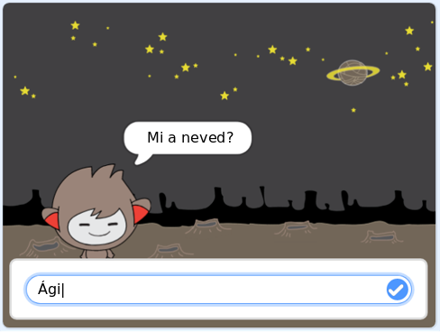

\--- no-print \---

Ez a projekt **Scratch 3** -as verziója. Van egy [Scratch 2-es](https://projects.raspberrypi.org/en/projects/chatbot-scratch2) változata is a projektnek.

\--- /no-print \---

## Bevezetés

Megtanulod, hogyan programozhatsz egy karaktert, amivel beszélhetsz veled! Olyan karaktert hívnak, mint egy chat robotot vagy chatbot-ot.

### Amit csinálni fogsz

\--- no-print \---

Kattintson a zöld zászlóra, majd kattintson a chatbot karakterre a beszélgetés megkezdéséhez. Amikor a chatbot megkérdez egy kérdést, írja be a választ a színpad alján található mezőbe, majd kattintson a jobb oldali kék jelre (vagy nyomja meg a `Enter`) a chatbot válaszának megtekintéséhez.

  <iframe allowtransparency="true" width="485" height="402" src="https://scratch.mit.edu/projects/embed/248864190/?autostart=false" 
  frameborder="0" scrolling="no"></iframe>

\--- /no-print \---

\--- csak nyomtatás \---

\--- / csak nyomtatás \---

\--- collapse \---

* * *

## title: Amire szükséged lesz

### Hardver

- A Scratch 3 futtatására alkalmas számítógép

### Szoftver

- Scratch 3 ( [online](https://rpf.io/scratchon) vagy [offline](https://rpf.io/scratchoff))

### Letöltések

- [Itt letöltheti a letölteni kívánt fájlokat](http://rpf.io/p/en/chatbot-go).

\--- /collapse \---

\--- collapse \---

* * *

## title: Amit meg fogsz tanulni

- Use code to concatenate strings in Scratch
- Tudja, hogy a változók felhasználhatók a felhasználói bevitel tárolására
- Feltételes kiválasztással válaszolhat a Scratch \--- / collapse \--- felhasználói bemenetre

\--- collapse \---

* * *

## title: További megjegyzések az oktatók számára

\--- no-print \---

Ha ki szeretnéd nyomtatni ezt a projektet, kérjük, használd a [nyomtatóbarát verzió](https://projects.raspberrypi.org/en/projects/chatbot/print) -t {:target="_ blank"}.

\--- /no-print \---

Itt található a [befejezett projekt](http://rpf.io/p/en/chatbot-get).

\--- /collapse \---