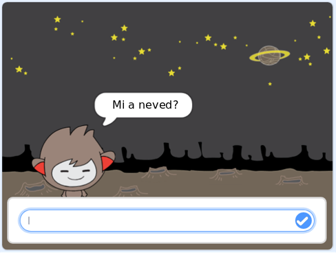
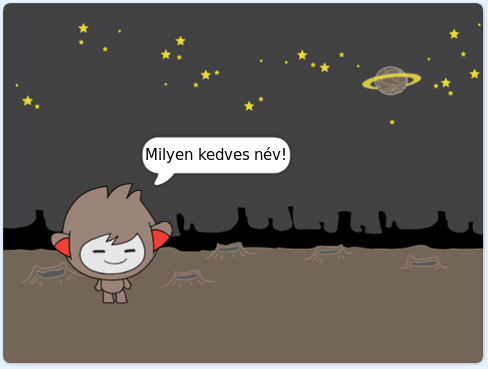
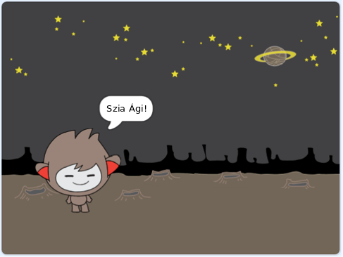

## Beszélő chatbot

Most, hogy van egy személyiséggel rendelkező chatbot, akkor azt tervezi, hogy beszéljen veled.

\--- task \---

Kattints a chatbot sprite-jére, és add hozzá ezt a kódot, hogy `ha rákattint az`{: class = "block3events"}, `megkérdezi a nevedet`{: class = "block3sensing"}, majd `azt mondja: " kedves név!"`{: class = "block3looks"}.


```blocks3
ha ez a szellem a kattintott
kérni [Mi a neved?], és várjon
mondják [Milyen szép név!] A (2) másodpercig
```

\--- /task \---

\--- task \---

A kód teszteléséhez kattintson a chatbotra. Amikor a chatbot megkérdezi a nevét, írja be a színpad alján látható mezőbe, majd kattintson a kék jelre, vagy nyomja meg a <kbd>Entert</kbd>.





\--- /task \---

\--- task \---

Most, a chatbot válaszol "Milyen szép név!" minden alkalommal, amikor válaszolsz. A chatbot válaszát személyesebbé teheti, hogy a válasz minden alkalommal más legyen, amikor egy másik nevet beírnak.

Változtassa meg a chatbot sprite kódját `csatlakozzon`{: class = "block3operators"} "Hi" a `válasz`{: class = "block3sensing"} -re a "Mi a neved?" kérdés, így a kód így néz ki:


```blocks3
ha ez a szellem a kattintott
kérni [Mi a neved?], és várjon
mondjuk (join [Hi] (válasz) :: +) a (2) másodpercig
```



\--- /task \---

\--- task \---

Tárolásával választ egy **változó**, akkor bárhol a projekt.

Az új változó nevű `neve`{: class = "block3variables"}.

[[[generic-scratch3-add-variable]]]

\--- /task \---

\--- task \---

Most változtassa meg a chatbot sprites kódját, hogy a `név`{: class = "block3variables"} változót állítsa `válaszra`: class = "block3sensing"}:


```blocks3
amikor ez a sprite
kattintott, kérdezze meg [Mi a neved?] és várjon

+ beállítást [név v] (válasz)
mondjon (csatlakozzon [Hi] (név :: változók +)) (2) másodpercig
```

A kódnak úgy kell működnie, mint korábban: a chatbotnak hiába kell használnia a beírt nevet.


\--- /task \---

Tesztelje újra a programot. Figyeljük meg, hogy a beírt válasz a `név`{: class = "block3variables"} változóban tárolódik, és megjelenik a színpad bal felső sarkában is. To make it disappear from the Stage, go to the `Variables`{:class="block3variables"} blocks section and click on the box next to `name`{:class="block3variables"} so that it is not marked.