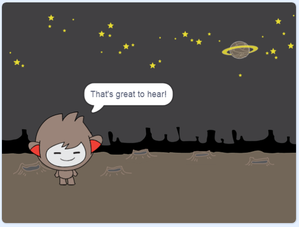

## Döntéshozatal

Beállíthatod a chatbotot úgy, hogy eldöntse, mit kell tennie a kapott válaszok alapján.

Először módosítsd a chatbotodat úgy, hogy olyan kérdést tegyen fel, amelyre "igen" vagy "nem" lehet a válasz.

\--- task \---

Változtasd meg a chatbot kódját! A chatbot-nak fel kell tennie a következő kérdést "Jól vagy ", a `név`{:class="block3variables"} változó használatával. Aztán válaszolnia kell úgy, hogy "Ezt jó hallani!" `ha`{:class="block3control"} a kapott válasz "igen", de ne mondjon semmit, ha a válasz "nem".





```blocks3
ezen szereplőre kattintáskor
kérdezd [Mi a neved?] és várj
[név v] legyen (válasz)
mondd: ([Szia ] és (név) összefűzve) (2) másodpercig
kérdezd ([Jól vagy ] és (név) összefűzve) és várj
ha <(válasz) = [igen]> akkor 
  mondd: [Ezt jó hallani!] (2) másodpercig
end
```

Az új kód helyes teszteléséhez **két próbát kell tenned**: egyszer az "igen" legyen a válasz, és másodszor pedig a "nem".

\--- /task \---

Jelenleg a chatbot nem mond semmit a "nem" válaszra.

\--- task \---

Változtasd meg a chatbot kódját úgy, hogy "Ó, nem!"-et mondjon, ha "nem"-mel válaszolsz a "Jól vagy" kérdésre.

Cserélje ki a `, majd`{: class = "block3control"} blokkot egy `ha, akkor még`: class = "block3control"} blokk, és tartalmazzon kódot, így a chatbot `mondhatja: "Ó, nem!"`{: class = "block3looks"}.


```blocks3
amikor ez a sprite rákattintott,
kérje a [Mi a neved?] és várjon
beállítást [név v] a (válasz)
(csatlakozzon a [Hi] (név)) -hez (2) másodpercig
kérjen (csatlakozzon [Are you OK] (csatlakozzon hozzá) név)) és várjon

+, ha <(válasz) = [yes]> majd 
  azt mondja [nagyszerű hallani!] (2) másodpercig
más 
+ mondja [Ó, ne!] (2) másodpercig
vége
```

\--- /task \---

\--- task \---

Tesztelje a kódot. Más választ kell kapnia, ha a "nem" válaszra válaszol, és ha "igen" választ ad: a chatbotjának válaszolnia kell "Ez nagyszerű hallani!" ha "igen" (ami nem kis- és nagybetűkre) válaszol, és válaszoljon az "Ó, nem!" ha **válaszolsz mást**.


\--- /task \---

Bármely kódot be lehet helyezni egy `ha, akkor másképpen`{: class = "block3control"} blokk, nem csak kódot, hogy a chatbotod beszéljen!

Ha rákattint a chatbot **Costumes** lapjára, látni fogja, hogy több ruha is van.


\--- task \---

Változtassa meg a chatbot kódját úgy, hogy a chatbot kapcsolja a jelmezeket, amikor beírja a választ.


Változtassa meg a kódot a `belül, ha, akkor még`{: class = "block3control"} blokk `kapcsoló jelmez`{: class = "block3looks"}.


```blocks3
amikor ez a sprite rákattintott,
kérje a [Mi a neved?] és várjon
beállítást [név v] a (válasz)
(csatlakozzon a [Hi] (név)) -hez (2) másodpercig
kérjen (csatlakozzon [Are you OK] (csatlakozzon hozzá) név)) és várjon
ha <(válasz) = [yes]> majd 

+ kapcsolót (nano-c v)
  mondja [Ez nagyszerű hallani!] (2) másodpercig
más 
+ kapcsolj jelmezet (nano- d v)
  mondja [Ó, nem!] (2) másodpercig
vége
```

Tesztelje és mentse a kódot. Meg kell látnia a chatbot arcát a válaszától függően.

\--- /task \---

Észrevetted, hogy a chatbot jelmezének megváltozása után ez így marad, és nem tér vissza az elejére?

Ezt kipróbálhatja: futtassa a kódját, és válaszoljon "nem" -re, hogy a chatbot arcát boldogtalan megjelenéssé változtassa. Ezután futtassa újra a kódját, és vegye észre, hogy a chatbot nem változik vissza boldognak, mielőtt megkérdezi a nevét.


\--- task \---

A probléma megoldásához adjuk hozzá a chatbot kódjához `kapcsoló jelmezet`{: class = "block3looks"} a `elején, amikor a sprite-ot rákattintják`{: class = "block3events"}.


```blocks3
amikor ez a sprite a

+ kapcsoló jelmezre kattint (nano-a v)
kérdezze meg [Mi a neve?] és várjon
```


\--- /task \---