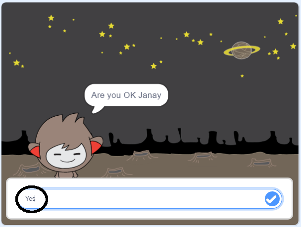
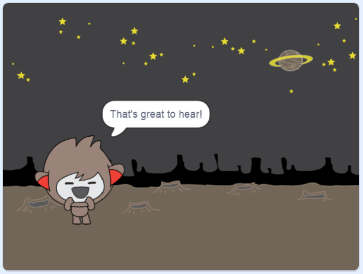

## Membuat keputusan

Anda dapat memprogram chatbot Anda untuk memutuskan apa yang harus dilakukan berdasarkan jawaban yang diterimanya.

Pertama, Anda akan membuat chatbot Anda mengajukan pertanyaan yang dapat dijawab dengan "ya" atau "tidak".

\--- tugas \---

Ubah kode chatbot Anda. Chatbot Anda harus menanyakan pertanyaan "Apakah Anda OK nama", menggunakan variabel `nama`{: class = "block3variables"}. Maka itu harus menjawab "Itu bagus untuk mendengar!" `jika`{: class = "block3control"} jawaban yang diterimanya adalah "ya", tetapi jangan katakan apa-apa jika jawabannya "tidak".




```blocks3
ketika sprite ini diklik
tanyakan [Siapa namamu?] dan tunggu
set [nama v] menjadi (jawab)
katakan (gabung [Hai] (nama)) selama (2) detik
+ tanyakan (gabung [Apakah kamu baik-baik saja] (nama)) dan tunggu
+ jika <(jawaban) = [yes]> lalu 
  katakan [Senang mendengar!] selama (2) detik
berakhir
```

Untuk menguji kode baru Anda dengan benar, Anda harus mengujinya **dua kali**: sekali dengan jawaban "ya", dan sekali dengan jawaban "tidak".

\--- /tugas \---

Saat ini, chatbot Anda tidak mengatakan apa pun pada jawaban "tidak".

\--- tugas \---

Ubah kode chatbot Anda sehingga itu menjawab "Oh tidak!" jika menerima "tidak" sebagai jawaban untuk "Apakah Anda baik-baik saja nama".

Ganti `jika, maka`{: class = "block3control"} blok dengan `jika, lalu, kalau lain`{: class = "block3control"} blok, dan sertakan kode sehingga obrolan dapat `mengatakan "Oh tidak!"`{: class = "block3looks"}.


```blocks3
ketika sprite ini diklik
tanyakan [Siapa namamu?] dan tunggu
set [nama v] menjadi (jawab)
katakan (gabung [Hai] (nama)) selama (2) detik
tanyakan (gabung [Apakah kamu baik-baik saja] ( name)) dan tunggu

+ jika <(jawaban) = [yes]> lalu 
  katakan [Itu bagus untuk didengar!] untuk (2) detik
lagi 
+ katakan [Oh tidak!] untuk (2) detik
akhir
```

\--- /tugas \---

\--- tugas \---

Uji kode Anda. Anda harus mendapatkan respons yang berbeda ketika Anda menjawab "tidak" dan ketika Anda menjawab "ya": chatbot Anda harus menjawab dengan "Itu bagus untuk didengar!" ketika Anda menjawab "ya" (yang tidak peka huruf besar-kecil), dan balas dengan "Oh tidak!" ketika Anda menjawab **hal lain**.


\--- /tugas \---

Anda dapat memasukkan kode apa pun ke dalam `jika, kemudian, kalau tidak blok`{: class = "block3control"}, bukan hanya kode untuk membuat chatbot Anda berbicara!

Jika Anda mengklik tab **Kostum** Anda di chatbot, Anda akan melihat bahwa ada lebih dari satu kostum.


\--- tugas \---

Ubah kode chatbot Anda sehingga chatbot mengganti kostum saat Anda mengetik jawaban Anda.




Ubah kode di dalam `jika, maka, jika tidak, blok`{: class = "block3control"} menjadi `switch kostum`{: class = "block3looks"}.


```blocks3
ketika sprite ini diklik
tanyakan [Siapa namamu?] dan tunggu
set [nama v] menjadi (jawab)
katakan (gabung [Hai] (nama)) selama (2) detik
tanyakan (gabung [Apakah kamu baik-baik saja] ( nama)) dan tunggu
jika <(jawaban) = [yes]> lalu 

+ ganti kostum ke (nano-c v)
  katakan [Itu bagus untuk didengar!] selama (2) detik
lain 
+ beralih kostum ke (nano- d v)
  katakan [Oh tidak!] selama (2) detik
berakhir
```

Uji dan simpan kode Anda. Anda akan melihat wajah chatbot Anda berubah tergantung pada jawaban Anda.

\--- /task \---

Pernahkah Anda memperhatikan bahwa, setelah kostum chatbot Anda berubah, itu tetap seperti itu dan tidak berubah kembali seperti semula?

Anda dapat mencobanya: jalankan kode Anda dan jawab "tidak" sehingga wajah chatbot Anda berubah menjadi tampilan yang tidak bahagia. Kemudian jalankan kembali kode Anda dan perhatikan bahwa chatbot Anda tidak berubah kembali menjadi tampak bahagia sebelum ia menanyakan nama Anda.


\--- tugas \---

Untuk memperbaiki masalah ini, tambahkan kode chatbot ke `ganti kostum`{: class = "block3looks"} di awal `ketika sprite diklik`{: class = "block3events"}.


```blocks3
ketika sprite ini mengklik

+ ganti kostum ke (nano-a v)
tanyakan [Siapa namamu?] dan tunggu
```


\--- /tugas \---