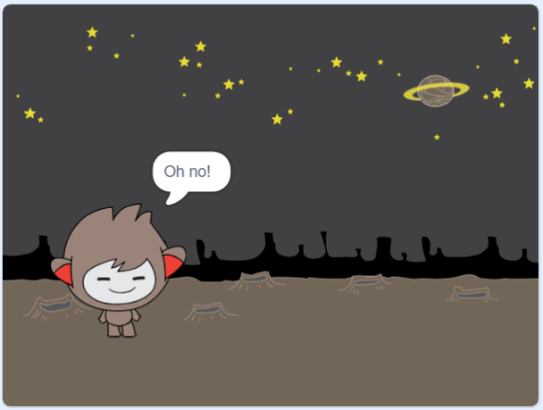
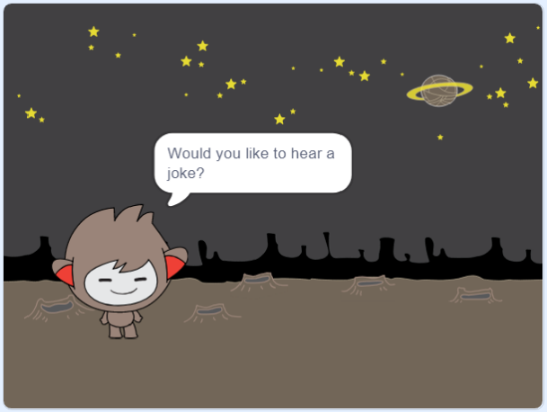

## Langkah 3: Membuat keputusan

Anda dapat memprogram chatbot Anda untuk memutuskan apa yang harus dikatakan atau lakukan berdasarkan tanggapan Anda terhadap pertanyaannya.

\--- tugas \---

Dapatkah Anda membuat chatbot menanyakan pertanyaan "Apakah Anda baik-baik saja?", Dan mengkodekannya untuk membalas, "Bagus mendengarnya!" hanya **jika** pengguna menjawab "ya"?

Untuk menguji kode baru Anda dengan benar, Anda harus mengujinya **dua kali**, sekali dengan jawaban "ya", dan sekali dengan jawaban "tidak".

Chatbot Anda seharusnya menjawab "Itu bagus untuk didengar!" jika Anda menjawab "ya", tetapi jangan mengatakan apa pun jika Anda menjawab "tidak".

\--- petunjuk \--- \--- petunjuk \--- Setelah chatbot Anda telah mengatakan "Hai", seharusnya sekarang juga **tanyakan** "Apakah Anda baik-baik saja?". **Jika** Anda menjawab "ya", maka chatbot harus **mengatakan** "Itu bagus untuk didengar!". \--- / hint \--- \--- hint \--- Berikut adalah blok kode tambahan yang Anda perlukan:  \--- / hint \--- \--- hint \--- Begini tampilan kode Anda:  \--- / petunjuk \--- \--- / petunjuk \---

\--- /tugas \---

\--- tugas \---

Saat ini, obrolan Anda tidak mengatakan apa-apa jika Anda menjawab "tidak". Bisakah Anda mengubah chatbot Anda sehingga juga menjawab "Oh tidak!" jika Anda menjawab "tidak" untuk pertanyaannya?

Uji dan simpan. Chatbot Anda seharusnya sekarang mengatakan "Oh tidak!" jika kamu menjawab "tidak". Bahkan, itu akan berkata "Tidak!" jika Anda menjawab dengan apa pun selain "ya" (angka **lain** dalam `if / else` blok berarti **atau**).

\--- petunjuk \--- \--- petunjuk \--- Chatbot Anda seharusnya sekarang mengatakan "Itu bagus untuk didengar!" **jika** jawaban Anda "ya", tetapi harus mengatakan "Oh tidak!" jika Anda menjawab sesuatu **lain**. \--- / hint \--- \--- hint \--- Berikut adalah blok kode yang harus Anda gunakan:  \--- / hint \--- \--- hint \--- Begini tampilan kode Anda:  \--- / petunjuk \--- \--- / petunjuk \---

\--- /tugas \---

\--- tugas \---

Anda dapat menempatkan kode apa pun di dalam blok `if / else` , bukan hanya kode untuk membuat chatbot Anda berbicara. Jika Anda mengeklik **tab Costume** di chatbot Anda, Anda akan melihat bahwa itu memiliki lebih dari satu kostum.

\--- /tugas \---

\--- tugas \---

Bisakah Anda mengubah kostum chatbot agar sesuai dengan jawaban Anda?

Uji dan simpan. Anda harus melihat perubahan wajah chatbot Anda tergantung pada jawaban Anda.

\--- petunjuk \--- \--- petunjuk \--- Chatbot Anda sekarang juga harus beralih **kostum** tergantung pada jawaban yang diberikan. \--- / hint \--- \--- hint \--- Berikut adalah blok kode yang harus Anda gunakan:  \--- / hint \--- \--- hint \--- Begini tampilan kode Anda:  \--- / petunjuk \--- \--- / petunjuk \---

\--- /tugas \---

\--- tugas \---

Pernahkah Anda memperhatikan bahwa kostum chatbot Anda tetap sama seperti yang Anda ubah ke terakhir kali Anda berbicara dengannya? Bisakah Anda memperbaiki masalah ini?

Uji dan simpan: Jalankan kode Anda dan ketik "tidak", sehingga chatbot Anda terlihat tidak senang. Ketika Anda menjalankan kode Anda lagi, chatbot Anda harus berubah kembali ke wajah tersenyum sebelum menanyakan nama Anda.

\--- petunjuk \--- \--- petunjuk \--- Ketika **sprite diklik**, chatbot Anda harus terlebih dahulu beralih **kostum** ke wajah tersenyum. \--- / hint \--- \--- hint \--- Inilah blok kode yang harus Anda tambahkan:  \--- / hint \--- \--- hint \--- Begini tampilan kode Anda:  \--- / petunjuk \--- \--- / petunjuk \---

\--- /tugas \---

\--- tantangan \---

## Tantangan: lebih banyak keputusan

Program obrolan Anda untuk mengajukan pertanyaan lain - sesuatu dengan jawaban "ya" atau "tidak". Bisakah Anda membuat chatbot Anda merespons jawabannya?

 \--- / tantangan \---