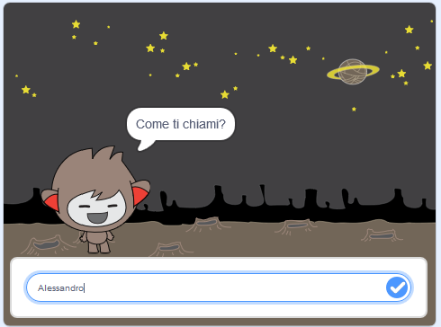

\--- no-print \---

Questa è la versione **Scratch 3** del progetto. C'è anche una [versione Scratch 2 del progetto](https://projects.raspberrypi.org/en/projects/chatbot-scratch2).

\--- /no-print \---

## Introduzione

Imparerai a programmare un personaggio che può parlare con te! Un elemento del genere è chiamato ChiacchieRobot o chatbot.

### Cosa creerai

\--- no-print \---

Clicca sulla bandierina verde, e poi clicca sul tuo chiacchierobot per iniziare una conversazione. Quando il chiacchierobot fa una domanda, digita la tua risposta nella casella in fondo, quindi fai clic sul segno blu a destra (o premi `Invio`) per vedere la risposta del chiacchierobot.

  <iframe allowtransparency="true" width="485" height="402" src="https://scratch.mit.edu/projects/embed/248864190/?autostart=false" 
  frameborder="0" scrolling="no"></iframe>

\--- /no-print \---

\--- print-only \---

\--- /print-only \---

## \--- collapse \---

## title: What you will need

### Hardware

- Un computer in grado di eseguire Scratch 3

### Software

- Scratch 3 ([online](https://rpf.io/scratchon) o [offline](https://rpf.io/scratchoff))

### Download

- [Trova i download qui](http://rpf.io/p/en/chatbot-go).

\--- /collapse \---

## \--- collapse \---

## title: What you will learn

- Use code to join text in Scratch
- Impara che le variabili possono essere utilizzate per memorizzare l'input dell'utente
- Use conditional selection to respond to user input in Scratch

\--- /collapse \---

## \--- collapse \---

## title: Additional notes for educators

\--- no-print \---

If you need to print this project, please use the [printer-friendly version](https://projects.raspberrypi.org/en/projects/chatbot/print){:target="_blank"}.

\--- /no-print \---

You can find the [completed project here](http://rpf.io/p/en/chatbot-get).

\--- /collapse \---