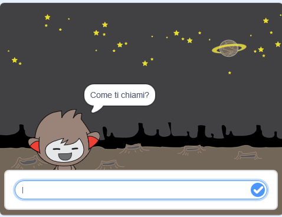
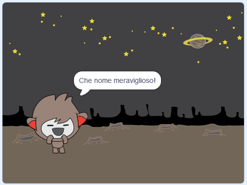
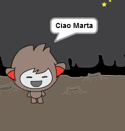

## Un ChiacchieRobot parlante

Adesso che hai un ChiacchieRobot con una personalità tutta sua, programmiamolo per farlo parlare.

\--- task \---

Fai clic sul tuo sprite chiacchierobot e aggiungi questo codice in modo che ` quando viene fatto clic ` {: class = "block3events"}, ` chiede il tuo nome ` {: class = "block3sensing"} e poi ` dice "Che bel nome!" ` {: Class = "block3looks"}.


```blocks3
when this sprite clicked
ask [Come ti chiami?] and wait
say [Che bel nome!] for (2) seconds
```

\--- /task \---

\--- task \---

Clicca sul tuo chiacchierobot per testare il tuo codice. Quando il chiacchierobot chiede il tuo nome, digitalo nella casella che appare in fondo allo schermo, quindi fai clic sul segno blu o premi <kbd> Invio </kbd>.





\--- /task \---

\--- task \---

In questo momento, il tuo chiacchierobot risponde "Che bel nome!" ogni volta che rispondi. Puoi rendere più personale la risposta, in modo che la risposta sia diversa ogni volta che viene digitato un nome diverso.

Cambia il codice dello sprite del chiacchierobot così da ` combinare ` {: class = "block3operators"} "Ciao" con la ` risposta ` {: class = "block3sensing"} alla domanda "Qual è il tuo nome?", in modo che il codice assomigli a questo:


```blocks3
when this sprite clicked
ask [Come ti chiami?] and wait
say (join [Ciao ] (answer) :: +) for (2) seconds
```



\--- /task \---

\--- task \---

Memorizzando la risposta in una ** variabile **, puoi usarla ovunque nel tuo progetto.

Crea una nuova variabile chiamata ` nome ` {: Class = "block3variables"}.

[[[generic-scratch3-add-variable]]]

\--- /task \---

\--- task \---

Ora, modifica il codice dello sprite del chiacchierobot per impostare la variabile ` nome ` {: class = "block3variables"} al valore della ` risposta ` {: Class = "block3sensing"}:


```blocks3
when this sprite clicked
ask [Come ti chiami?] and wait

+ set [nome v] to (answer)
say (join [Ciao ] (nome :: variables +)) for (2) seconds
```

Il tuo codice dovrebbe funzionare come prima: il tuo ChiacchieRobot dovrebbe dire ciao usando il tuo nome.


\--- /task \---

Prova di nuovo il tuo codice. Nota che la risposta che hai digitato è memorizzata nella variabile ` nome`{:class="block3variabili"} e viene mostrata anche nell'angolo in alto a sinistra dello schermo. To make it disappear from the Stage, go to the `Variables`{:class="block3variables"} blocks section and click on the box next to `name`{:class="block3variables"} so that it is not marked.