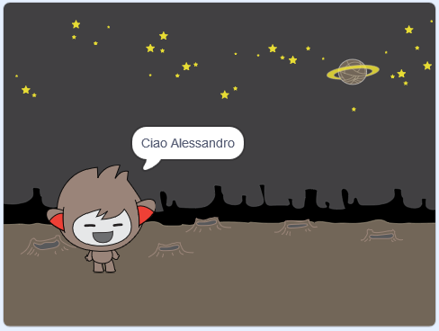

## Un ChiacchieRobot parlante

Adesso che hai un ChiacchieRobot con una personalità tutta sua, programmiamolo per farlo parlare.

--- task ---

Aggiungi del codice per fare in modo che quando si clicca sul ChiacchieRobot, ti chieda il tuo nome e poi dica "Che bel nome!"

--- hints --- --- hint --- **Quando clicchi sullo sprite**, il tuo ChiacchieRobot dovrebbe **chiederti** il tuo nome. Il ChiacchieRobot dovrebbe poi **dirti** "Che bel nome!" --- /hint --- --- hint --- Ecco di quali blocchi di codice avrai bisogno:  --- /hint --- --- hint --- Ecco come dovrebbe apparire il tuo codice:  --- /hint --- --- /hints ---

--- /task ---

--- task ---

Il tuo ChiacchieRobot risponderà semplicemente ‘Che bel nome!’ ogni volta. Puoi personalizzare la risposta del ChiacchieRobot usando la tua risposta?

--- hints --- --- hint --- **Quando clicchi sullo sprite** il tuo ChiacchieRobot dovrebbe **chiederti** il tuo nome. Il ChiacchieRobot dovrebbe poi **dire** "Ciao", seguito dalla tua **risposta**. --- /hint --- --- hint --- Ecco di quali blocchi di codice avrai bisogno:  --- /hint --- --- hint --- Ecco come dovrebbe apparire il tuo codice:  --- /hint --- --- /hints ---

--- /task ---

--- task ---

Puoi anche salvare il tuo nome in una **variabile**, in modo che tu possa usarlo di nuovo. Crea una nuova variabile chiamata `nome` per salvare il tuo nome.

[[[generic-scratch-add-variable]]]

--- /task ---

--- task ---

Puoi salvare il `nome` in una variabile e usarla nella risposta del ChiacchieRobot?

Il tuo codice dovrebbe funzionare come prima: il tuo ChiacchieRobot dovrebbe dire ciao usando il tuo nome.

--- hints --- --- hint --- **Quando clicchi sullo sprite** il tuo ChiacchieRobot dovrebbe **chiedere** il tuo nome. Dovresti **inserire** la variabile `nome` nella tua **risposta**. Il ChiacchieRobot dovrebbe poi **dirti** "Ciao", seguito dal tuo **nome**. --- /hint --- --- hint --- Ecco di quali blocchi di codice avrai bisogno:  --- /hint --- --- hint --- Ecco come dovrebbe apparire il tuo codice:  --- /hint --- --- /hints ---

--- /task ---

--- challenge ---

## Sfida: Altre domande

Programma il tuo ChiacchieRobot perché faccia un’altra domanda. Riesci a salvare la sua risposta in una variabile?

 --- /challenge ---