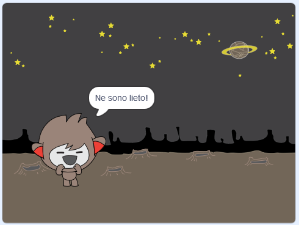
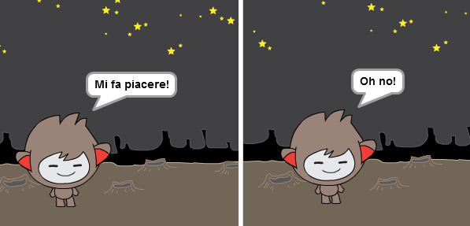
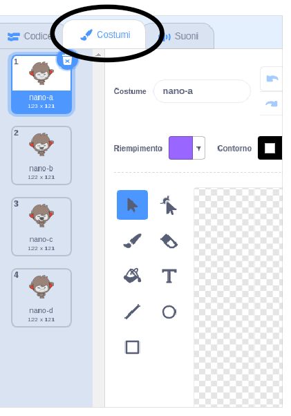
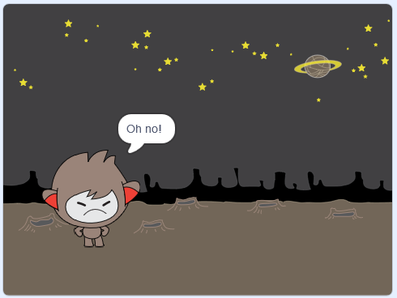
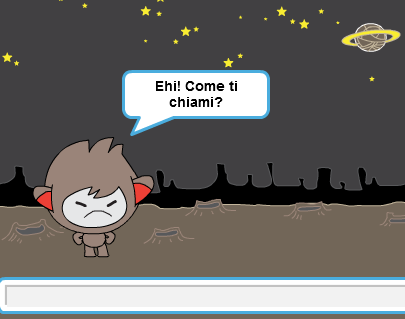
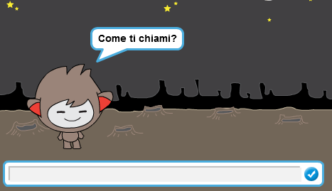

## Prendere decisioni

Puoi programmare il tuo ChiacchieRobot perché decida cosa dire o cosa fare in base alle risposte dell’utente.

Per prima cosa, farai fare al tuo chatbot una domanda alla quale si possa rispondere con "sì" o "no".

\--- task \---

Cambia il codice del tuo chiacchierobot. Il tuo chatbot dovrebbe porre la domanda "Stai bene", usando la variabile`nome`{: class = "block3variables"}. Quindi dovrebbe rispondere "Ne sono lieto!" `se` {: class = "block3control"} la risposta che riceve è "si" (senza accento), ma non dire nulla se la risposta è "no".





```blocks3
when this sprite clicked
ask [Come ti c hiami?] and wait
set [nome v] to (answer)
say (join [Ciao ] (nome)) for (2) seconds
+ask (join [Stai bene ] (name)) and wait
+if <(answer) = [si]> then 
  say [Ne sono lieto!] for (2) seconds
end
```

Per testare correttamente questo programma, dovrai provarlo **due volte**, una volta digitando "sì" come risposta, e un’altra volta digitando "no".

\--- /task \---

Al momento, il tuo chatbot non dice nulla alla risposta "no".

\--- task \---

Modifica il codice del tuo chatbot in modo che risponda "Oh no!" se riceve "no" come risposta a "Stai bene nome".

Sostituire `se` {: class = "block3control"} con un `se, allora, altrimenti` {: class = "block3control"} che include il codice in modo che il chatbot possa ` dire "Oh no!" ` {: Class = "block3looks"}.


```blocks3
when this sprite clicked
ask [Come ti chiami?] and wait
set [nome v] to (answer)
say (join [Ciao ] (nome)) for (2) seconds
+ask (join [Stai bene ] (name)) and wait
+if <(answer) = [si]> then 
  say [Ne sono lieto!] for (2) seconds
else 
+  say [Oh no!] for (2) seconds
end
```

\--- /task \---

\--- task \---

Prova di nuovo il tuo codice. Dovresti ottenere una risposta diversa quando rispondi "no" e quando rispondi "sì": il tuo chiacchierobot dovrebbe rispondere con "Ne sono lieto!" quando rispondi "si" (che non fa distinzione tra maiuscole e minuscole) e rispondi con "Oh no!" quando rispondi ** qualsiasi altra cosa **.




\--- /task \---

Dentro un blocco `se/altrimenti` puoi mettere qualsiasi codice, e non solo il codice che fa parlare il tuo ChiacchieRobot!

Se dai un’occhiata ai **costumi** del ChiacchieRobot, noterai che ce ne sono più di uno.



\--- task \---

Modifica il codice del tuo chatbot in modo che il chatbot cambi i costumi quando digiti la risposta.




Cambia il codice all'interno del `se, allora, altrimenti`{:class="block3control"} per `Cambiare costume`{:class="block3look"}.


```blocks3
when this sprite clicked
ask [Come ti chiami?] and wait
set [nome v] to (answer)
say (join [Ciao ] (nome)) for (2) seconds
+ask (join [Stai bene ] (name)) and wait
+if <(answer) = [si]> then 
+  switch costume to (nano-c v)
  say [Ne sono lieto!] for (2) seconds
else 
+  switch costume to (nano-d v)
  say [Oh no!] for (2) seconds
end
```

Prova il tuo codice e salvalo. La faccia del tuo ChiacchieRobot dovrebbe cambiare in base alla tua risposta.

\--- /task \---

Hai notato che, dopo che il costume del tuo chatbot è cambiato, rimane così e non ritorna a quello che era all'inizio?

Puoi provarlo: esegui il tuo codice e rispondi "no" in modo che il viso del tuo chatbot si trasformi in un aspetto infelice. Quindi esegui di nuovo il codice e nota che il tuo chatbot non torna a sembrare felice prima che ti chieda il tuo nome.



\--- task \---

Per risolvere questo problema, aggiungi il codice del chatbot a ` cambia costume ` {: class = "block3looks"} all'inizio ` quando si fa clic sullo sprite ` {: Class = "block3events"}.


```blocks3
when this sprite clicked

+ switch costume to (nano-a v)
ask [Come ti chiami?] and wait
```



\--- /task \---