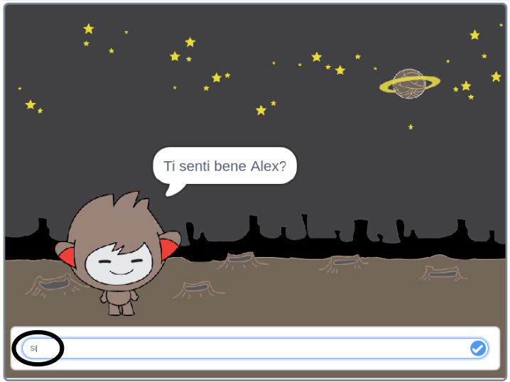
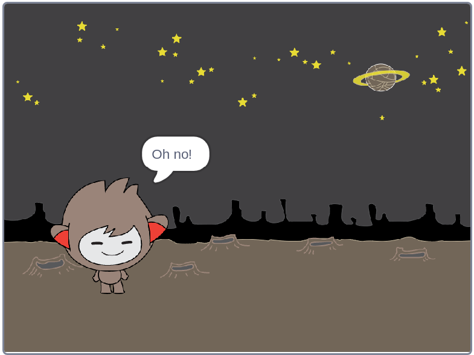

## Prendere decisioni

Puoi programmare il tuo ChiacchieRobot perché decida cosa dire o cosa fare in base alle risposte dell’utente.

Per prima cosa, farai fare al tuo chatbot una domanda alla quale si possa rispondere con "sì" o "no".

\--- task \---

Cambia il codice del tuo chiacchierobot. Il tuo chatbot dovrebbe porre la domanda "Stai bene", usando la variabile`nome`{:class="block3variables"}. Quindi dovrebbe rispondere "Ne sono lieto!" `se` {: class = "block3control"} la risposta che riceve è "si" (senza accento), ma non dire nulla se la risposta è "no".




```blocks3
quando si clicca questo sprite
chiedi [Come ti chiami?] e attendi
porta [nome v] a (risposta)
dire (unione di [Ciao ] e (nome)) per (2) secondi
+chiedi (unione di [Come stai, ] e (nome)) e attendi
+se <(risposta) = [si]> allora 
  dire [Ne sono lieto!] per (2) secondi
end
```

Per testare correttamente questo programma, dovrai provarlo **due volte**, una volta digitando "sì" come risposta, e un’altra volta digitando "no".

\--- /task \---

Al momento, il tuo chatbot non dice nulla alla risposta "no".

\--- task \---

Modifica il codice del tuo chatbot in modo che risponda "Oh no!" se riceve "no" come risposta a "Stai bene nome".

Sostituisci `se`{:class="block3control"} con un `se, allora, altrimenti` {:class="block3control"} che includa il codice in modo che il chatbot possa ` dire "Oh no!" ` {:Class="block3looks"}.


```blocks3
quando si clicca questo sprite
chiedi [Come ti chiami?] e attendi
porta [nome v] a (risposta)
dire (unione di [Ciao ] e (nome)) per (2) secondi
chiedi (unione di [Come stai, ] e (nome)) e attendi

+ se <(risposta) = [si]> allora 
  dire [Ne sono lieto!] per (2) secondi
altrimenti 
+ dire [Oh no!] per (2) secondi
end
```

\--- /task \---

\--- task \---

Prova di nuovo il tuo codice. Dovresti ottenere una risposta diversa quando rispondi "no" e quando rispondi "sì": il tuo chiacchierobot dovrebbe rispondere con "Ne sono lieto!" quando rispondi "si" (che non fa distinzione tra maiuscole e minuscole) e rispondere con "Oh no!" quando rispondi **qualsiasi altra cosa**.




\--- /task \---

Dentro un blocco `se,allora,altrimenti`{:class="block3control"} puoi mettere qualsiasi codice, e non solo il codice che fa parlare il tuo ChiacchieRobot!

Se dai un’occhiata ai **costumi** del ChiacchieRobot, noterai che ce ne sono più di uno.


\--- task \---

Modifica il codice del tuo chatbot in modo che cambi i costumi quando digiti la risposta.


Cambia il codice all'interno del `se,allora, altrimenti`{:class="block3control"} per `Cambiare costume`{:class="block3look"}.


```blocks3
when this sprite clicked
chiedi [Come ti chiami?] e attendi
porta [nome v] a (risposta)
dire (unione di [Ciao ] e (nome)) per (2) secondi
chiedi (unione di [Come stai ] e (name)) e attendi
se <(risposta) = [si]> allora 
+  passa al costume (nano-c v)
  dire [Ne sono lieto!] per (2) secondi
altrimenti 
+  passa al costume (nano-d v)
  dire [Oh no!] per (2) secondi
end
```

Prova il tuo codice e salvalo. L'espressione del tuo ChiacchieRobot dovrebbe cambiare in base alla tua risposta.

\--- /task \---

Hai notato che, dopo che il costume del tuo chatbot è cambiato, rimane così e non ritorna a quello iniziale?

Puoi provarlo: esegui il tuo codice e rispondi "no" in modo che il viso del tuo chatbot assuma un'espressione infelice. Quindi esegui di nuovo il codice e nota che il tuo chatbot non torna ad essere felice prima che ti chieda il tuo nome.


\--- task \---

Per risolvere questo problema, aggiungi il codice del chatbot a `cambia costume`{:class="block3looks"} all'inizio `quando si fa clic sullo sprite`{:Class="block3events"}.


```blocks3
quando si clicca questo sprite

+ passa al costume (nano-a v)
chiedi [Come ti chiami?] e attendi
```


\--- /task \---