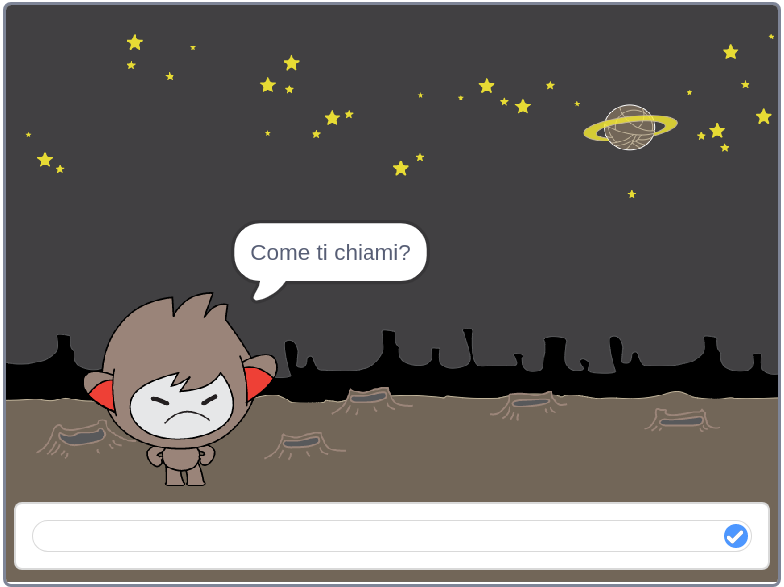

## Passo 3: Prendere decisioni

Puoi programmare il tuo ChiacchieRobot perché decida cosa dire o cosa fare in base alle risposte dell’utente.

\--- task \---

Sapresti programmare il tuo ChiacchieRobot in modo che ti chieda "Stai bene?", e che risponda "Mi fa piacere!" solo **se** rispondi "sì" (attenzione all'accento sulla ì!)?

Per testare correttamente questo programma, dovrai provarlo **due volte**, una volta digitando "sì" come risposta, e un’altra volta digitando "no".

Il tuo ChiacchieRobot dovrebbe rispondere "Mi fa piacere!" se la tua risposta è "sì", e non dire nulla se la tua risposta è "no".

\--- hints \--- \--- hint \--- Dopo che il ChiacchieRobot ha detto "Ciao", dovrebbe **chiedere** "Stai bene?". **Se** la tua risposta è "sì", il ChiacchieRobot dovrebbe **dire** "Mi fa piacere!". \--- /hint \--- \--- hint \--- Questi sono altri blocchi di codice di cui avrai bisogno:  \--- /hint \--- \--- hint \--- Ecco come dovrebbe apparire il tuo codice:  \--- /hint \--- \--- /hints \---

\--- /task \---

\--- task \---

Al momento, il tuo ChiacchieRobot non dice nulla se rispondi "no". Puoi programmare il tuo ChiacchieRobot in modo che ti dica "Oh no!" se rispondi "no" alla sua domanda?

Prova il tuo codice e salvalo. Adesso il tuo ChiacchieRobot dovrebbe dire "Oh no!" se rispondi "no". In realtà ti dirà "Oh no!" se rispondi in qualsiasi altro modo che non sia "sì" (l'**altrimenti** nel blocco `se/altrimenti` significa **diversamente**).

\--- hints \--- \--- hint \--- Ora il tuo ChiacchieRobot dovrebbe dire "Mi fa piacere!" **se** la tua risposta è "sì", ma dire "Oh no!" **altrimenti**. \--- /hint \--- \--- hint \--- Questi sono i blocchi di codice di cui avrai bisogno:  \--- /hint \--- \--- hint \--- Ecco come dovrebbe apparire il tuo codice:  \--- /hint \--- \--- /hints \---

\--- /task \---

\--- task \---

You can put any code inside an `if/else` block, not just code to make your chatbot speak. If you click your chatbot's **Costume** tab, you'll see that it has more than one costume.

\--- /task \---

\--- task \---

Can you change the chatbot's costume to match your response?

Test and save. You should see your chatbot's face change depending on your answer.

\--- hints \--- \--- hint \--- Your chatbot should now also **switch costume** depending on the answer given. \--- /hint \--- \--- hint \--- Here are the code blocks you'll need to use:  \--- /hint \--- \--- hint \--- Here's how your code should look:  \--- /hint \--- \--- /hints \---

\--- /task \---

\--- task \---

Have you noticed that your chatbot's costume stays the same that it changed to the last time you spoke to it? Can you fix this problem?

Test and save: Run your code and type "no", so that your chatbot looks unhappy. When you run your code again, your chatbot should change back to a smiling face before asking your name.

\--- hints \--- \--- hint \--- When the **sprite is clicked**, your chatbot should first **switch costume** to a smiling face. \--- /hint \--- \--- hint \--- Here's the code block you'll need to add:  \--- /hint \--- \--- hint \--- Here's how your code should look:  \--- /hint \--- \--- /hints \---

\--- /task \---

\--- challenge \---

## Sfida: Altre decisioni

Program your chatbot to ask another question - something with a "yes" or "no" answer. Can you make your chatbot respond to the answer?

 \--- /challenge \---