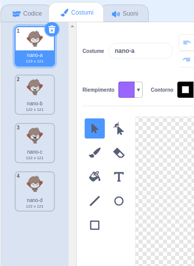

## Prendere decisioni

Puoi programmare il tuo ChiacchieRobot perché decida cosa dire o cosa fare in base alle risposte dell’utente.

--- task ---

Sapresti programmare il tuo ChiacchieRobot in modo che ti chieda "Stai bene?", e che risponda "Mi fa piacere!" solo **se** rispondi "sì" (attenzione all'accento sulla ì!)?

Per testare correttamente questo programma, dovrai provarlo **due volte**, una volta digitando "sì" come risposta, e un’altra volta digitando "no".

Il tuo ChiacchieRobot dovrebbe rispondere "Mi fa piacere!" se la tua risposta è "sì", e non dire nulla se la tua risposta è "no".

--- hints --- --- hint --- Dopo che il ChiacchieRobot ha detto "Ciao", dovrebbe anche **chiederti** "Stai bene?". **Se** la tua risposta è "sì", il ChiacchieRobot dovrebbe **dirti** "Mi fa piacere!". --- /hint --- --- hint --- Ecco di quali altri blocchi di codice avrai bisogno:  --- /hint --- --- hint --- Ecco come dovrebbe apparire il tuo codice:  --- /hint --- --- /hints ---

--- /task ---

--- task ---

Al momento, il tuo ChiacchieRobot non dice nulla se rispondi "no". Puoi programmare il tuo ChiacchieRobot in modo che ti dica "Oh no!" se rispondi "no" alla sua domanda?

Prova il tuo codice e salvalo. Adesso il tuo ChiacchieRobot dovrebbe dirti "Oh no!" se rispondi "no". In realtà ti dirà "Oh no!" se rispondi in qualsiasi altro modo che non sia "sì" (l'**altrimenti** nel blocco `se/altrimenti` significa **diversamente**).

--- hints --- --- hint --- Ora il tuo ChiacchieRobot dovrebbe dire "Mi fa piacere!" **se** la tua risposta è "sì", **altrimenti** dovrebbe dire "Oh no!". --- /hint --- --- hint --- Ecco di quali blocchi di codice avrai bisogno:  --- /hint --- --- hint --- Ecco come dovrebbe apparire il tuo codice:  --- /hint --- --- /hints ---

--- /task ---

--- task ---

Dentro un blocco `se/altrimenti` puoi mettere qualsiasi codice, e non solo il codice che fa parlare il tuo ChiacchieRobot. Se dai un’occhiata ai **costumi** del ChiacchieRobot, noterai che ce ne sono più di uno.

--- /task ---

--- task ---

Puoi cambiare il costume del ChiacchieRobot per farlo combaciare con la tua risposta?

Prova il tuo codice e salvalo. La faccia del tuo ChiacchieRobot dovrebbe cambiare in base alla tua risposta.

--- hints --- --- hint --- Il tuo ChiacchieRobot dovrebbe anche **cambiare costume** in base alla tua risposta. --- /hint --- --- hint --- Ecco di quali blocchi di codice avrai bisogno:  --- /hint --- --- hint --- Ecco come dovrebbe apparire il tuo codice:  --- /hint --- --- /hints ---

--- /task ---

--- task ---

Hai notato che il costume del tuo ChiacchieRobot è uguale a quello che aveva l'ultima volta che gli avevi parlato? Saresti in grado di risolvere questo problema?

Prova il tuo codice e salvalo. Esegui il codice e digita "no" per far sì che il ChiacchieRobot sia triste. Quando esegui di nuovo il codice, il ChiacchieRobot dovrebbe tornare ad essere felice, come quando lo era prima di chiederti il nome.

--- hints --- --- hint --- **Quando si clicca sullo sprite** il ChiacchieRobot dovrebbe **cambiare costume** e avere una faccia felice. --- /hint --- --- hint --- Ecco di quali blocchi di codice avrai bisogno:  --- /hint --- --- hint --- Ecco come dovrebbe apparire il tuo codice:  --- /hint --- --- /hints ---

--- /task ---

--- challenge ---

## Sfida: Altre decisioni

Programma il tuo ChiacchieRobot a fare un’altra domanda che abbia come risposta "sì" o "no". Sapresti come far reagire il ChiacchieRobot alla tua risposta?

 --- /challenge ---