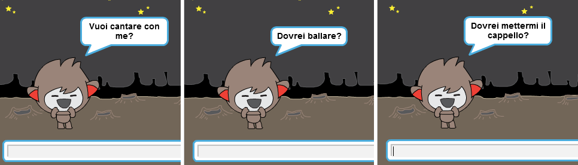

--- challenge ---

## Sfida: Completa il tuo ChiacchieRobot

Utilizza quello che hai imparato per completare la creazione del tuo ChiacchieRobot interattivo. Ecco alcune idee:

Una volta finito di creare il tuo ChiacchieRobot, invita i tuoi amici a fare una conversazione con lui! Ai tuoi amici piace il tuo personaggio? Hanno notato qualche problema? --- /challenge ---
***
### Traduzioni della Community 

Questo progetto è stato tradotto da **Silvia Caponio** e revisionato da **Alejandro Michetti**. 

Il nostro straordinario team di traduttori volontari ci permette di dare ai bambini di tutto il mondo la possibilità di imparare a programmare. Puoi aiutarci a raggiungere più bambini traducendo i nostri progetti - scopri di più su [rpf.io/translators](https://rpf.io/translators).