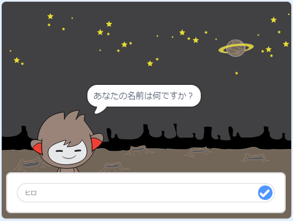

\--- no-print \---

これは、**Scratch 3**バージョンのプロジェクトです。[Scratch 2](https://projects.raspberrypi.org/en/projects/chatbot-scratch2)バージョンのプロジェクトもあります。

\--- /no-print \---

## はじめに

あなたと話しができるキャラクターをプログラムする方法を学びます！そのようなキャラクターは、チャットロボットまたはチャットボットと呼ばれます。

### 作るもの

\--- no-print \---

緑の旗をクリックし、チャットボットのキャラクターをクリックして会話を始めましょう。 チャットボットが質問をしたら、ステージの下部にあるボックスに答えを入力し、右にある青いマークをクリックして（または`Enter`を押して）チャットボットの返答を確認します。

  <iframe allowtransparency="true" width="485" height="402" src="https://scratch.mit.edu/projects/embed/248864190/?autostart=false" 
  frameborder="0" scrolling="no"></iframe>

\--- /no-print \---

\--- print-only \---

\--- /print-only \---

\--- collapse \---

* * *

## title: 必要なもの

### ハードウェア

- Scratch 3を実行できるコンピュータ

### ソフトウェア

- Scratch 3 ([オンライン](https://rpf.io/scratchon)または[オフライン](https://rpf.io/scratchoff))

### ダウンロード一覧

- [ここからダウンロードするファイルを探す](http://rpf.io/p/en/chatbot-go) 

\--- /collapse \---

\--- collapse \---

* * *

## title: 学習すること

- Scratchでコードを使用して文字列を連結する
- 変数を使用してユーザーの入力を保存できることを知る
- Scratchで条件付き選択を使用してユーザーの入力に返答する \--- / collapse \---

\--- collapse \---

* * *

## title: 教育者向けの追加メモ

\--- no-print \---

このプロジェクトを印刷する必要がある場合は[印刷用バージョン](https://projects.raspberrypi.org/en/projects/chatbot/print){:target="_blank"}を使用してください。

\--- /no-print \---

[ここで完成したプロジェクト](http://rpf.io/p/en/chatbot-get)を見ることができます 。

\--- /collapse \---