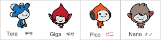

## 自分のチャットボット

\--- task \---

作る前に、チャットボットのせいかくを決めましょう。 **こんな風に考えてみましょう。**

+ チャットボットの名前は？
+ 住んでいる場所は？
+ 明るい？まじめ？面白い？おとなしい？親切？
+ 好きなものやきらいなものは何？

\--- /task \---

\--- task \---

「チャットボット」の基本 (きほん) のプロジェクトを開きます。 

**オンライン:** [rpf.i/chatbot-on](http://rpf.io/chatbot-on){:target="_blank"} から基本のプロジェクトを開きます。

Scratch アカウントを持っている場合は、**リミックス**をクリックしてプロジェクトのコピーを作ることができます。

**オフライン:** [rpf.io/p/en/chatbot-go](http://rpf.io/p/en/chatbot-go){:target="_blank"}から基本のプロジェクトをダウンロードして、オフラインエディターで開きます。

Scratch オフラインエディターは[https://rpf.io/scratchoff](rpf.io/scratchoff)からダウンロードしてインストールできます。

\--- /task \---

\--- task \---

基本のプロジェクトには4つのキャラクタースプライトがふくまれています。そのうちの一つがあなたのチャットボットになります。

すでに選択 (せんたく) されているスプライトを使うこともできますが、好きなスプライトをクリックし、ステージの下のスプライトメニューからスプライトを**表示 (ひょうじ) する**または**隠す (かくす)** ための目のアイコンをえらび、べつのスプライトを選択することもできます。

\--- /task \---