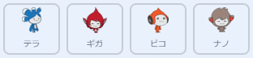

## 自分のチャットボット

\--- task \---

チャットボットを作り始める前に性格を決めましょう。**以下の質問について考えてみてください**。

+ チャットボットの名前は何ですか？
+ どこに住んでいますか？
+ 明るい？まじめ？面白い？おとなしい？優しい？
+ 好きなもの嫌いなものは何ですか？

\--- /task \---

\--- task \--- Scratchのチャットボットスタータープロジェクトを開きます。

**オンライン:** [rpf.io/chatbot-on](http://rpf.io/chatbot-on){:target="_blank"}にあるスタータープロジェクトを開きます。

Scratchアカウントをお持ちの場合は**リミックス**をクリックしてコピーを作成できます。

**オフライン:** [rpf.io/p/en/chatbot-go](http://rpf.io/p/en/chatbot-go){:target="_blank"}からスタータープロジェクトをダウンロードして、オフラインエディターで開きます。

Scratchオフラインエディターが必要ならば、[https://rpf.io/scratchoff](rpf.io/scratchoff)からダウンロードしてインストールできます。 \--- / task \---

\--- task \---

スタータープロジェクトには4つのキャラクタースプライトが含まれています。そのうちの一つがあなたのチャットボットになります。

You can either use the sprite that is already selected, or choose a different one by clicking the one you want and then selecting the **show** or **hide** eye icon from the Sprite menu below the stage.

\--- /task \---