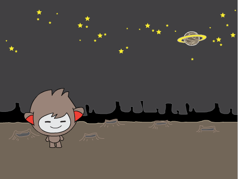

## 自分のチャットボット

--- task ---

作る前に、チャットボットのせいかくを決めましょう。 **こんな風に考えてみましょう。**

    + 名前は？
    + 住んでいる場所は？
    + 明るい？まじめ？面白い？はずかしがりや？親切？
    

--- /task ---

--- task ---

新しいScratchのプロジェクトを開きましょう。

[[[generic-scratch-new-project]]]

--- /task ---

--- task ---

キャラクターの絵をえらんで、プロジェクト内におきましょう。

[[[generic-scratch-sprite-from-library]]]

--- /task ---

--- task ---

キャラクターにあう背景（はいけい）をえらびましょう。こういう感じにしても良いですし、ちがう背景にすることもできます。

[[[generic-scratch-backdrop-from-library]]]

--- /task ---

--- task ---

プロジェクトを保存(ほぞん)しましょう。

[[[generic-scratch-saving]]]

--- /task ---