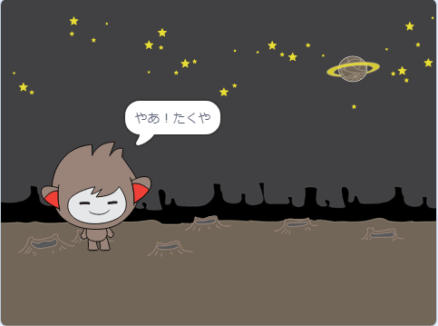

## おしゃべりチャットボット

チャットボットのせいかくが決まったので、おしゃべりできるようにプログラムしましょう。

\--- task \---

チャットボットのスプライトをクリックしてこのコードを追加 (ついか) し、`スプライトが押された (おされた) とき`{:class="block3events"}に`あなたの名前を聞いて`{:class="block3sensing"}、`「すてきな名前だね！」` {:class="block3looks"}と言うようにします。


```blocks3
このスプライトが押されたとき
[きみの名前は？] と聞いて待つ
[すてきな名前だね！] と (2) 秒言う
```

\--- /task \---

\--- task \---

チャットボットをクリックしてコードをテストします。チャットボットが名前を聞いたら、ステージの下部に表示されるボックスに名前を入力し、青いマークをクリックするか<kbd>Enter</kbd>をおします。


\--- /task \---

\--- task \---

今のところ、チャットボットは毎回「すてきな名前だね！」と答えます。ちがう名前が入力されるたびに返事をかえるようにすることで、もっと親しみやすくできます。

チャットボットのスプライトのコードを`～と～`{:class="block3operators"}に書きかえて、「やあ！」と「きみの名前は？」という質問 (しつもん) への`答え`{:class="block3sensing"}をつなげます。コードは次のようになります。


```blocks3
このスプライトが押されたとき
[きみの名前は？] と聞いて待つ
([やあ！] と (答え) :: +) と (2) 秒言う
```



\--- /task \---

\--- task \---

**変数** (へんすう) に答えを入れることで、プロジェクトのどの部分でも答えを使うことができます。

`名前`{:class="block3variables"}という新しい変数を作成 (さくせい) します。

[[[generic-scratch3-add-variable]]]

\--- /task \---

\--- task \---

次に、チャットボットのスプライトのコードをかえて`名前`{:class="block3variables"}変数を`答え`{:class="block3sensing"}に設定 (せってい) します。


```blocks3
このスプライトが押されたとき
[きみの名前は？] と聞いて待つ

+ [名前 v] を (答え) にする
([やあ！] と (名前 :: + variables)) と (2) 秒言う
```

前と同じようにコードは動きますが、チャットボットは入力された名前を使ってあいさつするはずです。


\--- /task \---

もう一度テストしてみましょう。 入力した答えは`名前`{:class="block3variables"}変数に保存 (ほぞん) されていて、ステージの左上すみにも表示されていることに注意してください。 ステージに表示されないようにするには、`変数`{:class="block3variables"}ブロックセクションから、`名前`{:class="block3variables"}のとなりにあるボックスをクリックしてチェックを外します。