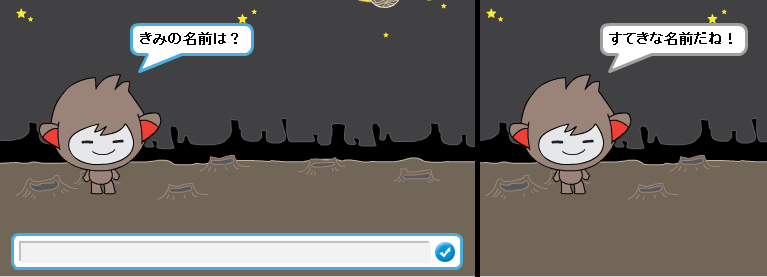
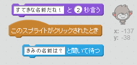
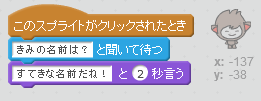
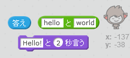
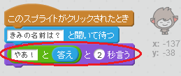
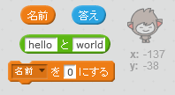
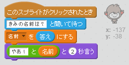
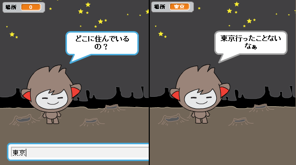

## おしゃべりチャットボット

チャットボットのせいかくが決まったので、おしゃべりができるようにプログラムしましょう。

--- task ---

クリックされた時に、チャットボットが名前を聞いたら「すてきな名前だね！」と答えるように、コードを入れてみましょう。

--- hints --- --- hint --- チャットボットが クリックされた時に、名前を聞くようにしましょう。 チャットボットは「すてきな名前だね！」と言います。 --- /hint --- --- hint --- 使うブロックはこちらです。  --- /hint --- --- hint --- コードの見本はこちらです。  --- /hint --- --- /hints ---

--- /task ---

--- task ---

チャットボットは毎回「すてきな名前だね!」と答えます。チャットボットの返答を個性的に変えることができますか？

--- hints --- --- hint --- チャットボットが クリックされた時に、名前を聞く ようにしましょう。 チャットボットは「やあ！」と言います。その後に、自分の答えが続きます。 --- /hint --- --- hint --- 使うブロックはこちらです。  --- /hint --- --- hint --- コードの見本はこちらです。  --- /hint --- --- /hints ---

--- /task ---

--- task ---

答えを変数（へんすう に入れると、後でも使うことができます。`名前`という変数を新しく作りましょう。

[[[generic-scratch-add-variable]]]

--- /task ---

--- task ---

自分の答えを`名前` 変数に入れて、チャットボットの答えに使ってみましょう。

前と同じようにコードは動きます。チャットボットは入力された名前を使って話します。

--- hints --- --- hint --- チャットボットが クリックされた時に、名前を聞く ようにしましょう。 `名前` 変数を答えにします。 そしてチャットボットは「やあ！」と答えます。その後に、自分の名前が続きます。 --- /hint --- --- hint --- 使うブロックはこちらです。  --- /hint --- --- hint --- コードの見本はこちらです。  --- /hint --- --- /hints ---

--- /task ---

--- challenge ---

## チャレンジ：質問（しつもん）をふやす

チャットボットがもう一つ他のことを聞いてくるようにプログラムしてみましょう。 答えを変数に入れられるでしょうか?

 --- /challenge ---