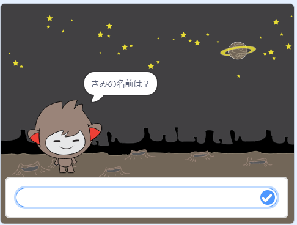

## いろいろな答え方

受け取った答えに応じてチャットボットが何を行うか決めるようにプログラムできます。

最初に、「はい」または「いいえ」で答えることができる質問をチャットボットにさせます。

\--- task \---

チャットボットのコードを変更します。 `名前`{:class="block3variables"}変数を使用して、チャットボットに「大丈夫ですか 名前」という質問をさせます。 次に、`もし`{:class="block3control"}「はい」という答えを受け取ったときには「それはよかった！」と返信させます。答えが「いいえ」の場合は何も言いません。


```blocks3
when this sprite clicked
ask [あなたの名前は何ですか？] and wait
set [名前 v] to (answer)
say (join [こんにちは ] (名前)) for (2) seconds
+ask (join [大丈夫ですか ] (名前)) and wait
+if <(回答) = [はい]> then 
  say [それはよかった！] for (2) seconds
end
```

新しいコードをきちんとテストするためには、**2回**テストする必要があります。答えが「はい」の時と「いいえ」の時です。

\--- /task \---

この段階では、「いいえ」という答えに対してチャットボットは何も言いません。

\--- task \---

チャットボットのコードを変更して、「大丈夫ですか 名前」という質問に対して「いいえ」という答えを受け取った場合、「あらら！」と返答するようにしましょう。

`もし～なら`{:class="block3control"}ブロックを`もし～なら～でなければ`{:class="block3control"}ブロックに置き換えて、チャットボットが `「あらら！」と言う`{:class="block3looks"}コードを付け加えます。


```blocks3
when this sprite clicked
ask [あなたの名前は何ですか？] and wait
set [名前 v] to (answer)
say (join [こんにちは ] (名前)) for (2) seconds
ask (join [大丈夫ですか ] (名前)) and wait

+ if <(回答) = [はい]> then 
  say [それはよかった！] for (2) seconds
else 
+  say [あらら！] for (2) seconds
end
```

\--- /task \---

\--- task \---

コードをテストしましょう。 あなたが「いいえ」と答えた場合と「はい」と答えた場合には、違う返答を受け取るはずです。「はい」と答えたときチャットボットは「それはよかった！」と返答し、**他のどんな答えでも**「あらら！」と返答します 。


\--- /task \---

`もし～なら～でなければ`{:class="block3control"}ブロックの中には、チャットボットの言葉だけではなく、どんなコードも入れることができます。

チャットボットの**コスチューム**タブをクリックすると、複数のコスチュームがあるのがわかると思います。


\--- task \---

チャットボットのコードを変更して、回答を入力したときにチャットボットがコスチュームを切り替えるようにします。


`もし～なら～でなければ`{:class="block3control"}ブロックの中のコードを変更して、`コスチュームを～にする`{:class="block3looks"}を追加します。


```blocks3
when this sprite clicked
ask [あなたの名前は何ですか？] and wait
set [名前 v] to (answer)
say (join [こんにちは ] (名前)) for (2) seconds
ask (join [大丈夫ですか ] (名前)) and wait
if <(回答) = [はい]> then 

+ switch costume to (nano-c v)
  say [それはよかった！] for (2) seconds
else 
+ switch costume to (nano-d v)
  say [あらら！] for (2) seconds
end
```

コードをテストして保存しましょう。あなたの答えによってチャットボットの顔が変わります。

\--- /task \---

チャットボットのコスチュームが変わった後、コスチュームはそのままで、最初の状態に戻らないことに気づきましたか？

次も試してみてください。コードを実行して「いいえ」と答えると、チャットボットが不満な顔になります。 次に、コードをもう一度実行して、チャットボットが名前を尋ねる前に幸せな顔に戻っていないことを確認します。


\--- task \---

この問題を解決するには、チャットボットのコードの`スプライトが押されたとき`{:class="block3events"}の先頭に`コスチュームを～にする`{:class="block3looks"}を追加します。


```blocks3
when this sprite clicked

+ switch costume to (nano-a v)
ask [あなたの名前は何ですか？] and wait
```



\--- /task \---