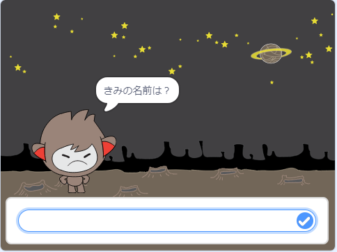

## ステップ3： いろいろな答え方

入力によって、チャットボットがちがう答え方をするようにプログラムすることができます。

\--- task \---

チャットボットが「元気？」と聞くと、入力が「はい」の時**だけ**「それはよかった！」と答えるようにできますか?

新しいコードをきちんとテストするためには、**2回**テストします。答えが「はい」の時と、「いいえ」の時です。

チャットボットは入力が「はい」の時は「それはよかった！」と答え、「いいえ」の時は何も言いません。

\--- hints \--- \--- hint \--- チャットボットが「やあ」と言うと、 「元気？」と**聞きます**。 チャットボットは答えが**「はい」**の時は、「それはよかった！」と**言います**。 \--- /hint \--- \--- hint \--- 新しく使うブロックはこちらです。  \--- /hint \--- \--- hint \--- コードの見本はこちらです。  \--- /hint \--- \--- /hints \---

\--- /task \---

\--- task \---

今の所、チャットボットは入力が「いいえ」の時は何も言ってくれません。答えが「いいえ」の時に、チャットボットが「それはこまったね・・・。」と言うようにできますか？

テストして保存しましょう。 チャットボットは答えが「いいえ」の時は「それはこまったね・・・。」と言います。 「いいえ」だけでなく、入力が「はい」以外の時、チャットボットは「それはこまったね・・・。」と答えます。

\--- hints \--- \--- hint \--- 入力が**「はい」**の時、チャットボットは「それはよかった！」と答えますが、 「はい」**以外**の時は「それはこまったね・・・。」と答えます。 \--- /hint \--- \--- hint \--- 使うブロックはこちらです。  \--- /hint \--- \--- hint \--- コードの見本はこちらです。  \--- /hint \--- \--- /hints \---

\--- /task \---

\--- task \---

`もし…なら／でなければ`のブロックには、チャットボットの言葉だけではなく、いろいろなコードを入れることができます。 チャットボットの**コスチューム**を見てみると、いくつかあるのがわかると思います。

\--- /task \---

\--- task \---

答えに合わせてチャットボットのコスチュームをかえることができますか?？

テストして保存しましょう。答えによってチャットボットの顔がかわります。

\--- hints \--- \--- hint \--- 答えによってチャットボットのが**コスチュームがかわります**。 \--- /hint \--- \--- hint \--- 使うブロックはこちらです。  \--- /hint \--- \--- hint \--- コードの見本はこちらです。  \--- /hint \--- \--- /hints \---

\--- /task \---

\--- task \---

チャットボットのコスチュームが、最後に話しかけた時と同じままであることに気づきましたか？ 直せますか？

テストして保存しましょう。コードをテストして「いいえ」と入力すると、チャットボットは怒った顔になります。もう一度テストすると、名前を聞く前に、笑顔にもどります。

\--- hints \--- \--- hint \--- チャットボットが**クリックされた時**、**コスチューム**が笑顔にかわります。 \--- /hint \--- \--- hint \--- Here's the code block you'll need to add:  \--- /hint \--- \--- hint \--- Here's how your code should look:  \--- /hint \--- \--- /hints \---

\--- /task \---

\--- challenge \---

## チャレンジ：もっといろいろな答え

Program your chatbot to ask another question - something with a "yes" or "no" answer. Can you make your chatbot respond to the answer?

 \--- /challenge \---