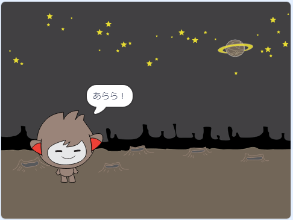

## ステップ3： いろいろな答え方

入力によって、チャットボットがちがう答え方をするようにプログラムすることができます。

\--- task \---

チャットボットが「元気？」と聞くと、入力が「はい」の時**だけ**「それはよかった！」と答えるようにできますか?

新しいコードをきちんとテストするためには、**2回**テストします。答えが「はい」の時と、「いいえ」の時です。

チャットボットは入力が「はい」の時は「それはよかった!」と答え、「いいえ」の時は何も言いません。

\--- hints \--- \--- hint \--- チャットボットが「やあ」と言うと、 「元気？」と**聞きます**。 チャットボットは答えが**「はい」**の時は、「それはよかった！」と**言います**。 \--- /hint \--- \--- hint \--- 新しく使うブロックはこちらです。  \--- /hint \--- \--- hint \--- コードの見本はこちらです。  \--- /hint \--- \--- /hints \---

\--- /task \---

\--- task \---

今の所、チャットボットは入力が「いいえ」の時は何も言ってくれません。答えが「いいえ」の時に、チャットボットが「それはこまったね・・・。」と言うようにできますか？

テストして保存しましょう。 チャットボットは答えが「いいえ」の時は「それはこまったね・・・。」と言います。 「いいえ」だけでなく、入力が「はい」以外の時、チャットボットは「それはこまったね・・・。」と答えます。

\--- hints \--- \--- hint \--- Your chatbot should now say "That's great to hear!" **if** your answer is "yes", but should say "Oh no!" if you answer something **else**. \--- /hint \--- \--- hint \--- Here are the code blocks you'll need to use:  \--- /hint \--- \--- hint \--- Here's how your code should look:  \--- /hint \--- \--- /hints \---

\--- /task \---

\--- task \---

You can put any code inside an `if/else` block, not just code to make your chatbot speak. If you click your chatbot's **Costume** tab, you'll see that it has more than one costume.

\--- /task \---

\--- task \---

Can you change the chatbot's costume to match your response?

Test and save. You should see your chatbot's face change depending on your answer.

\--- hints \--- \--- hint \--- Your chatbot should now also **switch costume** depending on the answer given. \--- /hint \--- \--- hint \--- Here are the code blocks you'll need to use:  \--- /hint \--- \--- hint \--- Here's how your code should look:  \--- /hint \--- \--- /hints \---

\--- /task \---

\--- task \---

Have you noticed that your chatbot's costume stays the same that it changed to the last time you spoke to it? Can you fix this problem?

Test and save: Run your code and type "no", so that your chatbot looks unhappy. When you run your code again, your chatbot should change back to a smiling face before asking your name.

\--- hints \--- \--- hint \--- When the **sprite is clicked**, your chatbot should first **switch costume** to a smiling face. \--- /hint \--- \--- hint \--- Here's the code block you'll need to add:  \--- /hint \--- \--- hint \--- Here's how your code should look:  \--- /hint \--- \--- /hints \---

\--- /task \---

\--- challenge \---

## チャレンジ：もっといろいろな答え

Program your chatbot to ask another question - something with a "yes" or "no" answer. Can you make your chatbot respond to the answer?

 \--- /challenge \---