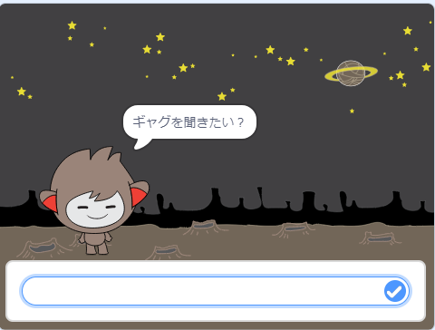

## いろいろな答え方

入力によって、チャットボットがちがう答え方をするようにプログラムすることができます。

--- task ---

チャットボットが「元気？」と聞くと、入力が「はい」の時だけ「それはよかった！」と答えるようにできますか?

新しいコードをきちんとテストするためには、2回テストします。答えが「はい」の時と、「いいえ」の時です。

チャットボットは入力が「はい」の時は「それはよかった！」と答え、「いいえ」の時は何も言いません。

--- hints --- --- hint --- チャットボットが「やあ」と言うと、 「元気？」と聞きます。 チャットボットは答えが「はい」の時は、「それはよかった！」と言います。 --- /hint --- --- hint --- 新しく使うブロックはこちらです。  --- /hint --- --- hint --- コードの見本はこちらです。  --- /hint --- --- /hints ---

--- /task ---

--- task ---

今の所、チャットボットは入力が「いいえ」の時は何も言ってくれません。答えが「いいえ」の時に、チャットボットが「それはこまったね・・・。」と言うようにできますか？

テストして保存しましょう。 チャットボットは答えが「いいえ」の時は「それはこまったね・・・。」と言います。 「いいえ」だけでなく、入力が「はい」以外の時、チャットボットは「それはこまったね・・・。」と答えます。

--- hints --- --- hint --- 入力が「はい」の時、チャットボットは「それはよかった！」と答えますが、 「はい」以外の時は「それはこまったね・・・。」と答えます。 --- /hint --- --- hint --- 使うブロックはこちらです。  --- /hint --- --- hint --- コードの見本はこちらです。  --- /hint --- --- /hints ---

--- /task ---

--- task ---

`もし…なら／でなければ`のブロックには、チャットボットの言葉だけではなく、いろいろなコードを入れることができます。 チャットボットのコスチュームを見てみると、いくつかあるのがわかると思います。

--- /task ---

--- task ---

答えに合わせてチャットボットのコスチュームをかえることができますか?？

テストして保存しましょう。答えによってチャットボットの顔がかわります。

--- hints --- --- hint --- 答えによってチャットボットのがコスチュームがかわります。 --- /hint --- --- hint --- 使うブロックはこちらです。  --- /hint --- --- hint --- コードの見本はこちらです。  --- /hint --- --- /hints ---

--- /task ---

--- task ---

チャットボットのコスチュームが、最後に話しかけた時と同じままであることに気づきましたか？ 直せますか？

テストして保存しましょう。コードをテストして「いいえ」と入力すると、チャットボットは怒った顔になります。もう一度テストすると、名前を聞く前に、笑顔にもどります。

--- hints --- --- hint --- チャットボットがクリックされた時、コスチュームが笑顔にかわります。 --- /hint --- --- hint --- 追加のブロックはこちらです。  --- /hint --- --- hint --- コードの見本はこちらです。  --- /hint --- --- /hints ---

--- /task ---

--- challenge ---

## チャレンジ：もっといろいろな答え

チャットボットが他のことも聞くようにプログラムしてみましょう。「はい」か「いいえ」で答えられるようにしましょう。あなたのチャットボットはきちんと答えられるでしょうか？

 --- /challenge ---
