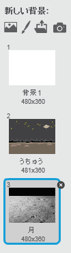
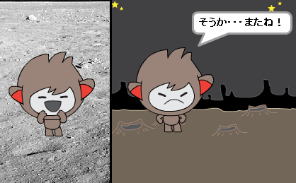
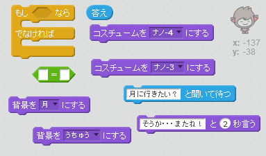
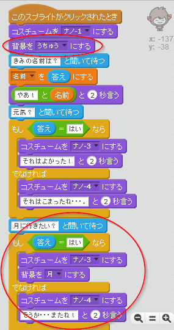
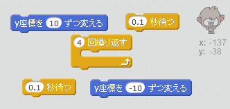
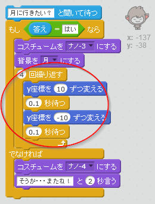

## 背景（はいけい）をかえる

チャットボットのいるところの背景をかえることができます。

--- task ---

ステージに他の背景、たとえば「月」を入れてみましょう。

--- /task ---

--- task ---

チャットボットが「月に行きたい?」と聞いた後、入力が「はい」の時に背景をかえることができますか?

テストして保存しましょう。答えが「はい」なら背景が変わります。他の答えなら、チャットボットは悲しそうな顔になって「そうか・・・またね」と言います。

--- hints --- --- hint --- チャットボットは「月に行きたい?」と聞きます。 もしあなたの答えが「はい」なら、コスチュームがかわって楽しそうな顔になり、背景がかわります。

「いいえ」なら、チャットボットのコスチュームがかわって悲しそうな顔になり、「そうか・・・またね」と言います。

クリックされた時、チャットボットがきちんと外にいるようにするために、コードを入れておきましょう。 --- /hint --- --- hint --- 使うブロックはこちらです。  --- /hint --- --- hint --- コードの見本はこちらです。  --- /hint --- --- /hints ---

--- /task ---

--- task ---

コードを入れ、月に行きたいと答えた時に、チャットボットをジャンプさせることができますか?

テストして保存しましょう。答えが「はい」なら、チャットボットはとびはねます。他の答えなら、ジャンプしません。

--- hints --- --- hint --- チャットボットのy座標（ざひょう）を少しずつかえると、ジャンプさせることができます。少し待った後に、元の場所にもどします。 何回かジャンプをくり返すのもいいでしょう。 --- /hint --- --- hint --- 使うブロックはこちらです。  --- /hint --- --- hint --- コードの見本はこちらです。  --- /hint --- --- /hints ---

--- /task ---