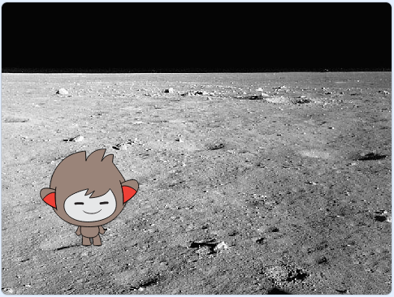

## 背景（はいけい）をかえる

チャットボットのいるところの背景をかえることができます。



\--- task \---

チャットボットが「月に行きたい？」と聞いた後、答えが「はい」の時に背景をかえることができますか？

\--- ヒント \---

\--- hint \---

チャットボットが`「月に行きたい？」と聞いて`{:class="block3sensing"}、`もし`{:class="block3control"}あなたの`答え`{:class="block3sensing"}が「はい」ならば、`背景を月にする`{:class="block3looks"}ようにします。

\--- /ヒント \---

\--- hint \---

こちらがチャットボットのコードに追加するコードブロックです。


```blocks3
背景を (月 v) にする

[月に行きたい？] と聞いて待つ

もし <(答え) = [はい]> なら 

end
```

\--- /ヒント \---

\--- hint \---

コードは次のようになります。

```blocks3
[月に行きたい？] と聞いて待つ
もし <(答え) = [はい]> なら 
  背景を (月 v) にする
end
```

\--- /hint \---

\--- /ヒント \---

\--- /task \---

\--- task \---

ここで、チャットボットをクリックして話しかけたときに、チャットボットが正しい場所で開始されることをたしかめる必要があります。このブロックをチャットボットのコードの先頭に追加しましょう。


```blocks3
このスプライトが押されたとき

+ 背景を (宇宙 v) にする
```

\--- /task \---

\--- task \---

プログラムをテストし、チャットボットが月に行きたいかどうかを聞いたら「はい」と答えます。チャットボットの場所がかわることがわかります。

\--- /task \---

\--- task \---

新しい`もし`{:class="block3control"}ブロックと次のコードを追加して、「はい」と答えたときに、チャットボットを4回上下にジャンプさせます。


```blocks3
もし <(答え) = [はい]> なら 
  背景を (月 v) にする

+  (4) 回繰り返す 
    y座標を (10) ずつ変える
    (0.1) 秒待つ
    y座標を (-10) ずつ変える
    (0.1) 秒待つ
  end
end
```

\--- /task \---