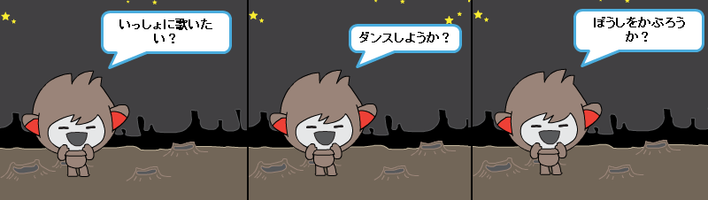

--- challenge ---

## チャレンジ: 自分のチャットボット

今まで学んだことを使って自分のチャットボットを作り上げましょう。このようなアイデアがあります。

チャットボットができあがったら、友だちにためしてもらいましょう! 気に入ってもらえましたか? おかしなところが見つかったりしましたか? --- /challenge ---

***
### コミュニティによる翻訳 

このプロジェクトの翻訳は松原慧子、レビューは慶士 三瀧が行いました。

すばらしい翻訳ボランティアは、世界中の子供たちにコーディングを学ぶチャンスを与えるのに役立っています。私たちのプロジェクトを翻訳することにより、より多くの子供たちにプログラミングを学んでもらう事ができます。詳しくは[rpf.io/translators](https://rpf.io/translators)をご覧ください。
