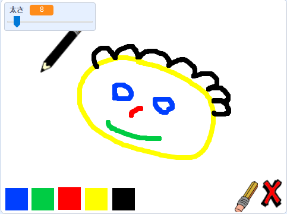

## 次は何をしましょうか？

お絵かきができるプログラムを作る、[ペイントボックス](https://projects.raspberrypi.org/ja-JP/projects/paint-box?utm_source=pathway&utm_medium=whatnext&utm_campaign=projects)プロジェクトをやってみましょう！

--- no-print ---

緑の旗 (はた) をクリックしてスタートします。 マウスを使ってえんぴつを動かし、マウスの左ボタンを押して絵をかきます。 色をクリックしてえんぴつをかえます。 消しゴムをクリックすると消しゴムにかわり、かいた絵を消すことができます。 ☓印をクリックすると、かいた絵がすべて消えます。

  <iframe allowtransparency="true" width="485" height="402" src="//scratch.mit.edu/projects/embed/380112299/?autostart=false" frameborder="0" scrolling="no"></iframe>
  

--- /no-print ---

--- print-only ---

緑の旗をクリックして始めます。マウスを使ってえんぴつを動かし、マウスの左ボタンを押して絵をかきます。 色をクリックするとえんぴつの色がかわり、消しゴムをクリックすると消しゴムにかわります！

--- /print-only ---

***

このプロジェクトは以下のボランティアによって翻訳されました。

横川 裕隆
松原慧子

ボランティアのおかげで、世界中の人々に母国語で学ぶ機会を与えることができます。翻訳を引き受けていただくことで、より多くの人々に手を差し伸べることができます。詳しくは [rpf.io/translate](https://rpf.io/translate) をご覧ください。

