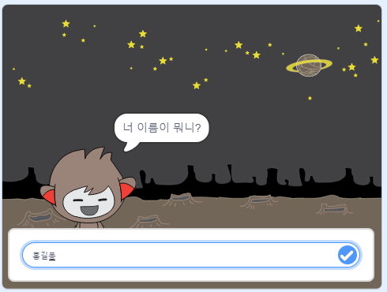

--- no-print ---

이 프로젝트의 **스크래치 3** 버전입니다. [프로젝트의 스크래치 2 버전](https://projects.raspberrypi.org/ko-KR/projects/chatbot-scratch2)도 있습니다.

--- /no-print ---

## 들어가며

여러분과 대화할 수 있는 캐릭터를 프로그래밍하는 방법에 대해 배우게 됩니다. 이런 캐릭터를 채팅 로봇 혹은 챗봇이라고 합니다.

### 만들게 될 것

--- no-print ---

초록 깃발을 누른 후에, 챗봇을 눌러서 대화를 시작합니다. 위의 화면에서 챗봇이 질문을 하면 하단에 위치한 텍스트 상자에 대답을 입력하고 상자 우측에 위치한 파란색 마크를 클릭 (또는 `Enter`를 누르세요) 하세요. 그러면 챗봇이 응답을 합니다.

  <iframe allowtransparency="true" width="485" height="402" src="https://scratch.mit.edu/projects/embed/239023644/?autostart=false" 
  frameborder="0" scrolling="no"></iframe>

--- /no-print ---

--- print-only ---

--- /print-only ---

--- collapse ---
---
title: 준비물
---

### 하드웨어

- 스크래치 3을 실행할 수 있는 컴퓨터

### 소프트웨어

- 스크래치 3 ([온라인](https://rpf.io/scratchon) 또는 [오프라인](https://rpf.io/scratchoff))

### 다운로드

- [여기에서 다운로드 할 파일을 찾으십시오](http://rpf.io/p/ko-KR/chatbot-go).

--- /collapse ---

--- collapse ---
---
title: 배우게 될 것
---

- 코드를 사용하여 스크래치에서 문자열 연결하기
- 변수가 사용자 입력을 저장하는 데 사용될 수 있음을 이해하기
- 조건부 선택을 사용하여 Scratch 에서 사용자 입력에 응답 
--- /collapse ---

--- collapse ---
---
title: 교육자를 위한 추가 정보
---
--- no-print ---

이 프로젝트를 인쇄하려면, [프린트용 버전](https://projects.raspberrypi.org/ko-KR/projects/chatbot/print){:target="_blank"}을 사용하십시오.

--- /no-print ---

여기서 [완료된 프로젝트를 확인할 수 있습니다](http://rpf.io/p/ko-KR/chatbot-get).

--- /collapse ---