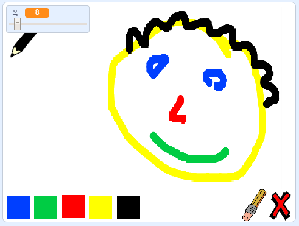

## 더 나아가기

페인팅 프로그램인 [페인트 박스](https://projects.raspberrypi.org/en/projects/paint-box?utm_source=pathway&utm_medium=whatnext&utm_campaign=projects) 프로젝트를 해 보세요!

\--- no-print \--- 녹색 깃발을 클릭하여 시작하세요. 마우스를 사용하여 연필을 이동할 수 있고, 마우스 왼쪽 버튼을 누른 상태로 드래그를 하면 선을 그릴 수 있습니다. 색상을 클릭하여 연필의 색을 변경해 보세요. 지우개를 클릭하여 자신의 그림을 변경하거나 제거하는데 사용할 수 있습니다. 페이지를 지우려면 X표시를 클릭 해 보세요.

  <iframe allowtransparency="true" width="485" height="402" src="//scratch.mit.edu/projects/embed/267243161/?autostart=false" frameborder="0" scrolling="no"></iframe>
  

\--- /no-print \---

\--- 인쇄 전용 \--- 시작하려면 녹색 깃발을 클릭하고, 마우스를 사용하여 연필을 이동하고 마우스 왼쪽 버튼을 누른 상태로 드래그 하면 선을 그릴 수 있습니다. 색상을 클릭하면 연필 색상이 변경되고 지우개를 클릭하면 지우개로 변경됩니다!

 \--- /print-only \---