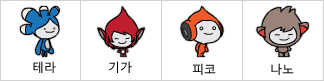

## 당신의 챗봇

\--- task \---

챗봇을 만들기 전에 챗봇의 성격을 결정해야 합니다.**다음 질문에 대해서 생각해 보십시오.**:

+ 챗봇의 이름은 무엇입니까?
+ 챗봇은 어디에 사나요?
+ 챗봇은 행복한가요? 진지한가요? 웃긴가요? 부끄러워 하나요?
+ 챗봇은 무엇을 좋아하고 싫어합니까?

\--- /task \---

\--- task \--- 챗봇 스크래치 스타터 프로젝트를 엽니다.

** 온라인: ** [ rpf.io/chatbot-on ](http://rpf.io/chatbot-on) {: target = "_ blank"}에서 새로운 스타터 프로젝트 열기.

스크래치 계정이있는 경우 ** Remix를 클릭 ** 하여 사본을 만들 수 있습니다.

**오프라인:** 오프라인 시작 프로그램을 [rpf.io/p/en/chatbot-go](http://rpf.io/p/en/chatbot-go){:target="_blank"} 에서 다운로드하고, 오프라인 에디터로 파일을 엽니다.

스크래치 오프라인 에디터를 다운로드 받아 설치하려면, [https://rpf.io/scratchoff](rpf.io/scratchoff) 에서 다운 받을 수 있습니다. \--- /task \---

\--- task \---

스타터 프로젝트에는 4개의 캐릭터 스프라이트가 있습니다. 이 중 하나를 선택합니다.

You can either use the sprite that is already selected, or choose a different one by clicking the one you want and then selecting the **show** or **hide** eye icon from the Sprite menu below the stage.

\--- /task \---