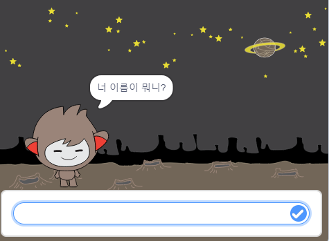
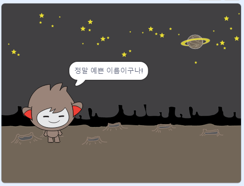
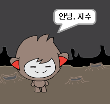

## 말하는 챗봇

챗봇의 성격을 정했으니, 챗봇과 대화할 수 있게 프로그램해 봅시다.

\--- task \---

챗봇 스프라이트를 클릭을 하고, 다음 코드를 넣어보세요. `챗봇 스프라이트를 클릭했을 때`{:class="block3events"} `이름을 묻고`{:class="block3sensing"} ` "정말 예쁜 이름이구나!" 를 말하게 하세요. `{:class="block3looks"}.


```blocks3
이 스프라이트를 클릭했을 때
[너 이름이 뭐니?] 라고 묻고 기다리기
[정말 예쁜 이름이구나!] 을(를) (2) 초 동안 말하기
```

\--- /task \---

\--- task \---

코드를 테스트하려면 챗봇을 클릭하십시오. 대화방에서 이름을 묻는 메시지가 표시되면 스테이지 하단에있는 상자에 입력 한 다음 파란색 아이콘을 클릭하거나 <kbd>Enter</kbd>를 클릭합니다.





\--- /task \---

\--- task \---

지금, 여러분의 챗봇은 "정말 예쁜 이름이구나!" 라고만 대답합니다. 챗봇의 답변을 개인화하여 다른 이름을 입력하면 답변이 달라지도록 설계할 수 있나요?

챗봇의 스프라이트 코드에 `결합하기`{:class="block3operators"}를 사용하여, 안녕이라는 인사말과 함께`답변`{:class="block3sensing"} 에 상대방의 이름을 물어보도록 해 보세요. 아래와 같이 프로그래밍할 수 있습니다:


```blocks3
이 스프라이트를 클릭했을 때
[너 이름이 뭐니?] 라고 묻고 기다리기
[결합하기[Hi ] (답변) :: +] 을(를) (2) 초 동안 말하기
```



\--- /task \---

\--- task \---

**변수**에 응답을 저장함으로써 프로젝트에서 사용할 수 있습니다.

`name`{:class="block3variables"}이라는 이름의 새 변수를 추가 해 보세요.

[[[generic-scratch3-add-variable]]]

\--- /task \---

\--- task \---

이제, 챗봇의 스프라이트 코드를 변경하여 `name`{:class="block3variables"} 변수를 `answer`{:class="block3sensing"}에 저장할 수 있도록 하세요:


```blocks3
이 스프라이트를 클릭했을 때
[너 이름이 뭐니?] 라고 묻고 기다리기

+ [name v] 을(를) (answer) 로 정하기
 (join [안녕 ] (name :: variables +)) 을(를) (2) 초 동안 말하기
```

코드는 이전과 같이 작동해야 합니다: 챗봇은 여러분이 알려준 이름을 사용해서 인사해야 합니다.


\--- /task \---

프로젝트를 다시 테스트해 보세요. 입력 한 응답은 `name` {:class="block3variables"} 변수에 저장되며 스테이지의 왼쪽 상단 모서리에도 표시됩니다. To make it disappear from the Stage, go to the `Variables`{:class="block3variables"} blocks section and click on the box next to `name`{:class="block3variables"} so that it is not marked.