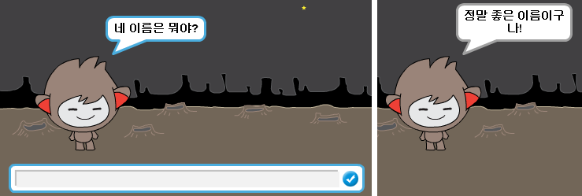
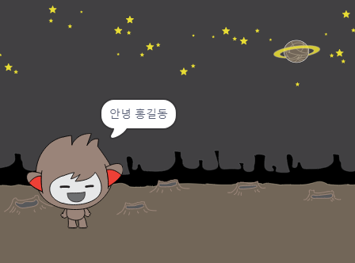

## 말하는 로봇

챗봇의 성격을 정했으니, 챗봇이 당신에게 말할 수 있도록 프로그램을 만들어 봅시다.

--- task ---

챗봇을 클릭했을 때, 챗봇이 당신의 이름을 묻고 "정말 좋은 이름이구나!"라고 대답하도록 코드를 추가해 보세요.

--- hints --- --- hint --- 챗봇 **요정을 클릭하면** 챗봇이 당신의 이름을 **물어봐야** 합니다. 그리고 나서 챗봇이 "정말 좋은 이름이구나!" 라고 **말해야** 합니다. --- /hint --- --- hint --- 추가로 필요한 코드 블럭은 다음과 같습니다:  --- /hint --- --- hint --- 작성해야 하는 코드의 형태입니다.  --- /hint --- --- /hints ---

--- /task ---

--- task ---

이제 챗봇은 단순하게 "정말 좋은 이름이구나!"라고 매번 대답하게 됩니다. 내가 대답한 이름을 이용해서 좀더 개성적으로 대답하게 바꿀 수 있습니까?

--- hints --- --- hint --- 챗봇 **요청이 클릭되면** 당신의 이름을 **물어봐야** 합니다. 챗봇은 당신의 **대답** 이후에 "안녕, " 이라고 **답해야** 합니다. --- /hint --- --- hint --- 필요한 코드 블럭들은 다음과 같습니다:  --- /hint --- --- hint --- 작성해야 하는 코드의 형태입니다:  --- /hint --- --- /hints ---

--- /task ---

--- task ---

여러분의 이름을 **변수**에 저장하면, 나중에 사용할 수 있습니다. `이름`이라는 새 변수를 만들어서 이름을 저장합니다.

[[[generic-scratch-add-variable]]]

--- /task ---

--- task ---

`이름` 변수에 당신의 대답을 저장하고 챗봇이 대답하는데 그 이름을 사용하게 할 수 있습니까?

코드는 이전과 같이 작동해야 합니다: 당신의 챗봇은 당신의 이름을 사용해서 인사해야 합니다.

--- hints --- --- hint --- 챗봇 **요정이 클릭 될 때** 챗봇이 당신의 이름을 **물어봐야** 합니다. 그리고나서 `이름` 변수를 **대답**으로 **정해야** 합니다. 이제 챗봇은 당신의 **이름**을 따라 "안녕!" 이라고 **말해야** 합니다. --- /hint --- --- hint --- 필요한 코드 블럭들은 다음과 같습니다:  --- /hint --- --- hint --- 작성해야 하는 코드의 형태입니다:  --- /hint --- --- /hints ---

--- /task ---

--- challenge ---

## 도전과제: 더 많은 질문들

챗봇이 다른 질문들을 하도록 프로그램 해 보십시오. 새로운 변수에 대답을 저장 할 수 있습니까?

 --- /challenge ---