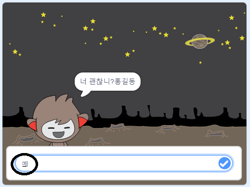
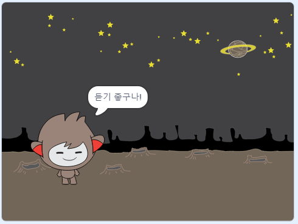
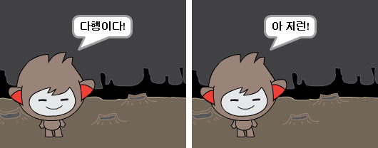
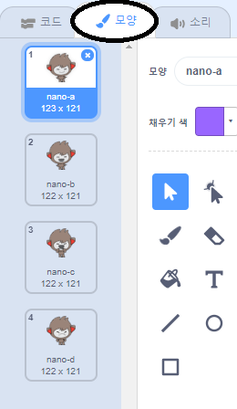
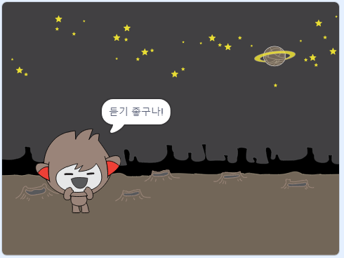
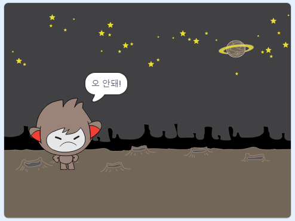
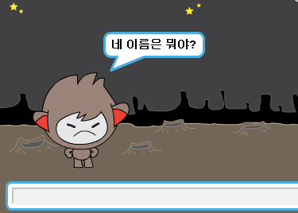
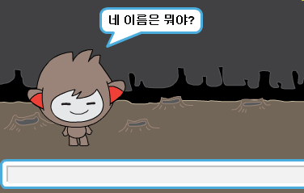

## 결정하기

당신의 대답에 따라서 챗봇이 어떤 말을 할지 아니면 어떤 행동을 할지 프로그래밍 할 수 있습니다.

먼저, 대화방에 "예"또는 "아니오"로 대답 할 수있는 질문을 할 것 입니다.

\--- task \---

챗봇의 코드를 변경하십시오. chatbot은 ` 이름 ` {: class = "block3variables"} 변수를 사용하여 "name 너 괜찮니?"라는 질문을 해야 합니다. `만약`{:class="block3control"} 응답이 "예" 인 경우 "듣기 좋네!" 라고 출력하고, 응답이 "아니오" 인 경우 아무것도 말하지 않습니다.






```blocks3
이 스프라이트를 클릭했을 때
[너 이름이 뭐니?] 라고 묻고 기다리기
[name v] 을(를) (answer)로 정하기
(결합하기[안녕 ] (name)) 을(를) (2) 초 동안 말하기
+(결합하기[너 괜찮니? ] (name)) 라고 묻고 기다리기
+만약 <(대답) = [yes]> (이)라면
  [듣기 좋네!] 을(를) (2) 초 동안 말하기
끝
```

새 코드를 제대로 테스트 하기 위해 **두번**의 테스트를 해봐야 합니다. 한번은 "응" 이라고 대답하고, 다른 한번은 "아니" 라고 대답해 봅니다.

\--- /task \---

현재 채팅 봇은 "아니오"라고 대답하지 않습니다.

\--- task \---

챗봇의 코드를 변경하여 "너 괜찮니? name"에 대한 대답으로 "아니오"를 받으면, "오, 안돼!" 라고 대답하도록 변경하세요.

`만약 (이)라면`{:class="block3control"} 블록을 `만약 (이)라면, 아니면`{:class="block3control"} 블록으로 바꿔 챗봇이 `"오 안돼!"`{:class="block3looks"}라고 말하게 프로그래밍하세요.


```blocks3
이 스프라이트를 클릭했을 때
[너 이름이 뭐니?] 라고 묻고 기다리기
[name v] 을(를) (answer)로 정하기
(결합하기[안녕 ] (name)) 을(를) (2) 초 동안 말하기
+(결합하기[너 괜찮니? ] (name)) 라고 묻고 기다리기
+만약  <(대답) = [yes]> (이)라면
  [듣기 좋구나!] 을(를) (2) 초 동안 말하기
아니면
+  [오, 안돼!] 을(를) (2) 초 동안 말하기
끝
```

\--- /task \---

\--- task \---

코드를 테스트해 보세요. "아니오"의 대답과, "예"의 대답에서 서로 다른 응답을 받아야합니다. 만약 예라고 한 경우 챗봇은 "듣기 좋구나!"라고 대답해야합니다. ** 만약 예가 아닌 경우 어떠한 경우에도 "오 안돼!"** 를 출력하여야 합니다.




\--- /task \---

`if/else` 블럭 사이에 로봇을 말하게 하는 것 말고도, 어떤 코드든 넣을 수 있습니다!

챗봇의 **모양(Costume)** 탭을 클릭하면, 로봇에게 여러가지 모양이 있는것을 볼 수 있습니다.



\--- task \---

챗봇의 코드를 변경하여 답변을 입력할 때 챗봇이 코스튬을 전환하도록 하십시오.





`만약, 이라면, 아니면`{:class="block3control"} 블록에 `모양 바꾸기`{:class="block3looks"} 블록을 추가하세요.


```blocks3
이 스프라이트를 클릭했을 때
[너 이름이 뭐니?] 라고 묻고 기다리기
[name v] 을(를) (answer)로 정하기
(결합하기[안녕 ] (name)) 을(를) (2) 초 동안 말하기
(결합하기[너 괜찮니? ] (name)) 라고 묻고 기다리기
만약  <(대답) = [yes]> (이)라면

+ 모양을 (nano-c v) 로 바꾸기
  [듣기 좋구나!] 을(를) (2) 초 동안 말하기
아니면
+ 모양을 (nano-d v) 로 바꾸기
  [오, 안돼!] 을(를) (2) 초 동안 말하기
끝
```

테스트하고 저장하십시오. 당신의 대답에 따라 챗봇의 얼굴이 바뀌어야 합니다.

\--- /task \---

챗봇의 코스튬이 변경된 후에도 그와 같은 상태로 유지되고 처음에 있었던 상태로 돌아 가지 않는다는 것을 알아챘습니까?

이것을 시도해 볼 수 있습니다 : 코드를 실행하고 "아니오"라고 대답하면 챗봇 표정의 얼굴이 불행한 모습으로 바뀌도록 합니다. 그런 다음 코드를 다시 실행하고 대화 상대가 귀하의 이름을 묻기 전에 챗봇의 얼굴이 불행해 보이는지 확인해 보세요.



\--- task \---

이 문제를 해결하기 위해서, 챗봇에 `모양 바꾸기`{:class="block3looks"} 코드를 `이 스프라이트를 클릭했을 때`{:class="block3events"} 블록 밑에 비치하는 방법이 있습니다.


```blocks3
이 스프라이트를 클릭했을 때

+ 모양을 (nano-a v) 로 바꾸기
[너 이름이 뭐니?] 라고 묻고 기다리기
```



\--- /task \---