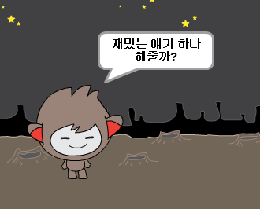

## 결정하기

당신의 대답에 따라서 챗봇이 어떤 말을 할지 아니면 어떤 행동을 할지 프로그래밍 할 수 있습니다.

--- task ---

챗봇이 "요즘 잘 지내?"라고 물어보았을 때 "응" 이라고 대답했을 **때에만** "다행이다!"라고 대답하도록 만들 수 있습니까?

새 코드를 제대로 테스트 하기 위해 **두번**의 테스트를 해봐야 합니다. 한번은 "응" 이라고 대답하고, 다른 한번은 "아니" 라고 대답해 봅니다.

당신의 챗봇은 "응"이라고 대답했을 때에만 "다행이다!" 라고 대답하고, "아니" 라고 말했을때에는 아무런 말도 하지 않아야 합니다.

--- hints --- --- hint --- 이제 챗봇이 "안녕" 이라고 말한 후에, "요즘 잘 지내?" 라고 **물어봐야** 합니다. **만약** 대답이 "응"이라면, 로봇은 "다행이다!" 라고 **말해야**합니다. --- /hint --- --- hint --- 추가로 필요한 코드 블럭은 다음과 같습니다:  --- /hint --- --- hint --- 작성해야 하는 코드의 형태입니다:  --- /hint --- --- /hints ---

--- /task ---

--- task ---

당신이 "아니" 라고 대답하면 로봇은 아무런 말도 하지 않습니다. "아니"라고 대답했을 때 로봇도 "아 저런!" 이라고 대답하게 바꿀 수 있습니까?

테스트하고 저장하십시오. 당신의 대답이 "아니" 라면, 챗봇은 이제 "아 저런!" 이라고 말해야 합니다. 실제로는, 당신의 대답이 "응" 이 아닌 어떤것이든 "아 저런!"이라고 대답할 것입니다. (`만약에/아니면` 블럭안에 있는 **아니면** 블럭은 **그렇지 않으면**을 의미합니다).

--- hints --- --- hint --- 이제 로봇은 대답이 **만약**"응" 이라면 "다행이다!" 라고 말하고, "응"이 **아니면** "아 저런!" 이라고 대답해야 합니다. --- /hint --- --- hint --- 필요한 코드 블럭들은 다음과 같습니다:  --- /hint --- --- hint --- 작성해야 하는 코드의 형태입니다:  --- /hint --- --- /hints ---

--- /task ---

--- task ---

`if/else` 블럭 사이에 로봇을 말하게 하는 것 말고도, 어떤 코드든 넣을 수 있습니다. 챗봇의 **모양(Costume)** 탭을 클릭하면, 로봇에게 여러가지 모양이 있는것을 볼 수 있습니다.

--- /task ---

--- task ---

당신의 응답에 맞춰서 챗봇의 모양을 바꿀 수 있습니까?

테스트하고 저장하십시오. 당신의 대답에 따라 챗봇의 얼굴이 바뀌어야 합니다.

--- hints --- --- hint --- 당신의 챗봇은 이제 대답에 따라 **모양이 바뀌어야** 합니다. --- /hint --- --- hint --- 필요한 코드 블럭들은 다음과 같습니다:  --- /hint --- --- hint --- 작성해야 하는 코드의 형태입니다:  --- /hint --- --- /hints ---

--- /task ---

--- task ---

챗봇의 모습이 마지막으로 변경된 것과 동일한 상태로 유지된다는 것을 알고 계셨습니까? 이 문제를 해결할 수 있습니까?

테스트 및 저장: 코드를 실행하고 "아니" 라고 입력해서 챗봇이 불만을 표현하도록 해보십시오. 코드를 다시 실행했을 때, 로봇은 당신의 이름을 묻기 전에 웃는 얼굴로 바뀌어야 합니다.

--- hints --- --- hint --- **요정이 클릭 될 때**, 챗봇은 먼저 웃는 얼굴로 **모양이 바뀌어** 있어야 합니다. --- /hint --- --- hint --- 필요한 코드 블럭들은 다음과 같습니다:  --- /hint --- --- hint --- 작성해야 하는 코드의 형태입니다:  --- /hint --- --- /hints ---

--- /task ---

--- challenge ---

## 도전과제: 더 많은 결정들

로봇이 "응" 이나 "아니" 로 대답할 수 있는 다른 질문을 하도록 프로그램 해보십시오. 당신의 대답에 로봇이 반응하게 만들 수 있습니까?

 --- /challenge ---