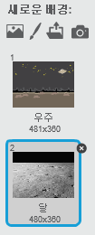
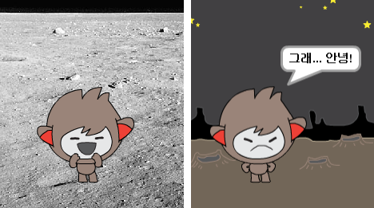
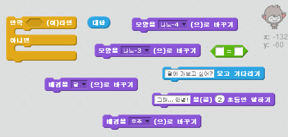
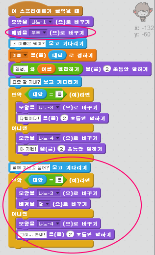
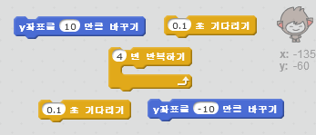
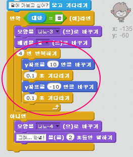

## 장소 바꾸기

챗봇이 장소를 바꾸도록 코드를 만들 수 있습니다.

--- task ---

무대에 다른 배경을 추가 해보십시오. 예를 들어 "달" 같은 배경을 추가할 수 있습니다.

--- /task ---

--- task ---

"달에 가보고 싶니?" 라는 챗봇의 물음에 "응"이라고 대답하면 장소가 바뀌도록 코드를 만들 수 있습니까?

테스트 하고 저장하십시오. 당신이 "응" 이라고 대답하면, 로봇은 장소를 바꿔야 합니다. 만약 "응"이 아닌 다른 대답을 했다면, 로봇은 슬픈 표정으로 "그래... 안녕!" 이라고 대답해야 합니다.

--- hints --- --- hint --- 로봇은 "달에 가보고 싶니?" 라고 **물어봐야** 합니다. **만약** "응"이라고 당신이 **대답** 하면, 로봇은 기쁜 표정으로 **모습을 바꾸고** 무대의 **배경** 이 바뀌어야 합니다.

당신이 "아니"라고 대답하면 로봇은 슬픈 표정으로 **모양을 바꾸고** "그래...안녕!" 이라고 **말해야** 합니다.

**요정이 클릭될 때** 챗봇이 제대로 된 장소에서 시작하도록 코드를 추가해야 합니다. --- /hint --- --- hint --- 필요한 코드 블럭들은 다음과 같습니다:  --- /hint --- --- hint --- 작성해야 하는 코드의 형태입니다:  --- /hint --- --- /hints ---

--- /task ---

--- task ---

달에 가고 싶다고 말하면 챗봇이 기뻐서 점프하도록 코드를 추가 할 수 있습니까?

테스트 하고 저장하십시오. 이제 당신이 "응" 이라고 대답하면 로봇이 위 아래로 점프해야 합니다. "응" 이 아닌 다른 대답을 했을 때에는 점프하면 안됩니다.

--- hints --- --- hint --- 챗봇의 **y 좌표**를 조금 **바꿔서** 점프하게 만들고, 잠시 **기다린** 후에 다시 원래 위치로 되돌려놓으면 됩니다. 아마 이 작업을 몇 번 **반복**하고 싶을 수 있습니다. --- /hint --- --- hint --- 필요한 코드 블럭들은 다음과 같습니다:  --- /hint --- --- hint --- 작성해야 하는 코드의 형태입니다:  --- /hint --- --- /hints ---

--- /task ---