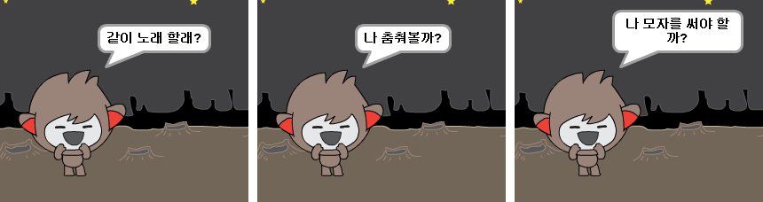

--- challenge ---

## 도전 과제: 챗봇을 완성하세요

그동안 배운 것들을 활용해서 챗봇을 완성하십시오. 다음은 몇 가지 아이디어 입니다:

챗봇을 완성하고 나면, 친구들을 불러 챗봇과 이야기 나누도록 해보십시오. 친구들이 당신의 챗봇 캐릭터를 좋아합니까? 친구들이 어떤 문제를 발견했습니까? --- /challenge ---
***
### 커뮤니티 기여 번역 

이 프로젝트는 **노영진** 가 번역하였고 **이완선** 가 검토하였습니다. 

우리의 놀라운 번역 자원 봉사자들은 전 세계의 어린이들에게 코딩을 배울 수 있는 기회를 제공합니다. 우리 프로젝트 번역에 참여하여 더 많은 아이들에게 도움을 줄 수 있습니다. 자세한 내용은 [rpf.io/translators](https://rpf.io/translators)에서 확인하세요.
