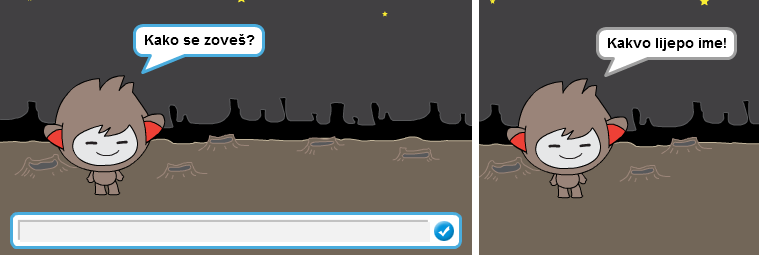
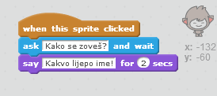
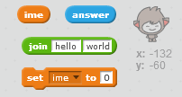

## Pričljivi robot

Sada kada imaš robota sa osobinama, hajde da ga programiramo da razgovara sa tobom.

--- task ---

Dodaj kôd svom robotu tako da te upita kako se zoveš kada klikneš na njega, a zatim kaže "Kakvo lijepo ime!"

--- hints --- --- hint --- Kada je **kliknuto na lik** robota (sprite is clicked), on treba da te **pita** (ask) kako se zoveš. Robot zatim treba da **kaže** (say) "Kakvo lijepo ime!" --- /hint --- --- hint --- Ovdje su blokovi kôda koji će ti biti potrebni:  --- /hint --- --- hint --- Ovako bi trebalo da izgleda tvoj kôd:  --- /hint --- --- /hints ---

--- /task ---

--- task ---

Sada robot svaki put odgovara samo "Kakvo lijepo ime!". Možeš li da prilagodiš odgovor svog robota tako što ćeš iskoristiti svoj odgovor?

--- hints --- --- hint --- Kada je **kliknuto na lik** robota (sprite is clicked), on treba da te **pita** (ask) kako se zoveš. Zatim robot treba da **kaže** (say) "Zdravo", posle kojeg slijedi tvoj **odgovor** (answer). --- /hint --- --- hint --- Ovdje su blokovi kôda koji će ti biti potrebni:  --- /hint --- --- hint --- Ovako bi trebalo da izgleda tvoj kôd:  --- /hint --- --- /hints ---

--- /task ---

--- task ---

Ako sačuvaš svoj odgovor u **promjenljivoj** (variable), možeš ga koristiti kasnije. Kreiraj novu promjenljivu pod nazivom `ime` da u njoj sačuvaš svoje ime.

[[[generic-scratch-add-variable]]]

--- /task ---

--- task ---

Da li možeš da sačuvaš svoj odgovor u promjenljivoj `ime` i da ga iskoristiš u robotovom odgovoru?

Tvoj kôd treba da funkcioniše kao i ranije: robot treba da te pozdravi koristeći tvoje ime.

--- hints --- --- hint --- Kada je **kliknuto na lik** robota (sprite is clicked), on treba da te **pita** (ask) kako se zoveš. Zatim treba da **postaviš** (set) da promjenljiva `ime` bude tvoj **odgovor** (answer). Nakon toga, robot treba da **kaže** (say) "Zdravo" i, uz pozdrav, da kaže tvoje **ime**. --- /hint --- --- hint --- Ovdje su blokovi kôda koji će ti biti potrebni:  --- /hint --- --- hint --- Ovako bi trebalo da izgleda tvoj kôd:  --- /hint --- --- /hints ---

--- /task ---

--- challenge ---

## Izazov: više pitanja

Programiraj svog robota da postavi neko drugo pitanje. Možeš li da sačuvaš odgovor u novoj promjenljivoj?

 --- /challenge ---