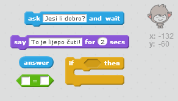
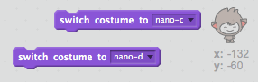

## Donošenje odluka

Možeš da programiraš svog robota da odluči šta će da kaže ili uradi na osnovu tvojih odgovora na pitanja koje je postavio.

--- task ---

Možeš li da napraviš da tvoj robot postavi pitanje "Jesi li dobro?", a zatim da dodaš kôd tako da odgovori "To je lijepo čuti!" samo **ako je** (if) odgovor korisnika "da"?

Za pravilno isprobavanje tvog novog kôda, potrebno je da ga isprobaš **dva puta**, jednom sa odgovorom "da" i jednom sa odgovorom "ne".

Tvoj robot bi trebalo da odgovori "To je lijepo čuti!" ako je tvoj odgovor "da", a da ništa ne kaže ako je tvoj odgovor "ne".

--- hints --- --- hint --- Nakon što je tvoj robot rekao "Zdravo", sada treba i da te **pita** (ask) "Jesi li dobro?". **Ako je** (if) tvoj odgovor "da", robot treba da **kaže** (say) "To je lijepo čuti!". --- /hint --- --- hint --- Ovdje su dodatni blokovi kôda koji će ti biti potrebni:  --- /hint --- --- hint --- Ovako bi trebalo da izgleda tvoj kôd:  --- /hint --- --- /hints ---

--- /task ---

--- task ---

Trenutno, tvoj robot ništa ne kaže na tvoj odgovor "ne". Možeš li da izmijeniš svog robota tako da odgovori "O, ne!" ako je tvoj odgovor na njegovo pitanje ''ne''?

Isprobaj i sačuvaj. Sada, ako je tvoj odgovor "ne", robot treba da kaže "O, ne!". U stvari, robot će reći "O, ne!" ako odgovoriš bilo šta drugo osim "da" (**else** u bloku `if/else` znači **drugačije**).

--- hints --- --- hint --- Tvoj robot sada treba da kaže "To je lijepo čuti!" **ako je** (if) tvoj odgovor "da". Ako odgovoriš **drugačije** (else), robot treba da kaže "O, ne!". --- /hint --- --- hint --- Ovdje su blokovi kôda koji će ti biti potrebni:  --- /hint --- --- hint --- Ovako bi trebalo da izgleda tvoj kôd:  --- /hint --- --- /hints ---

--- /task ---

--- task ---

Možeš da postaviš bilo koji kôd unutar bloka `if/else` (ako/inače), ne samo kôd kojim ćeš napraviti da tvoj robot govori. Ako klikneš na karticu **Costumes** (Kostimi) tvog robota, primijetićeš da ima nekoliko kostima.

--- /task ---

--- task ---

Da li možeš da promijeniš kostim robota tako da bude prilagođen tvom odgovoru?

Isprobaj i sačuvaj. Trebalo bi da vidiš da se lice tvog robota mijenja zavisno od tvog odgovora.

Tvoj robot sada, takođe, treba da **promijeni kostim** (switch costume) zavisno od odgovora koji mu je dat. 

--- hints --- --- hint --- Ovdje su blokovi kôda koji će ti biti potrebni:  --- /hint --- --- hint --- Ovako bi trebalo da izgleda tvoj kôd:  --- /hint --- --- /hints ---

--- /task ---

--- task ---

Da li primjećuješ da je kostim tvog robota i dalje isti onaj koji je promijenio kada je poslednji put razgovarao sa tobom? Da li možeš da riješiš ovaj problem?

Isprobaj i sačuvaj: Pokreni svoj kôd i upiši "ne", tako da tvoj robot izgleda tužan. Kada ponovo pokreneš kôd, tvoj robot treba da bude nasmijan prije nego što te upita kako se zoveš.

--- hints --- --- hint --- Kada je **kliknuto na lik** (sprite is clicked), tvoj robot prvo treba da **promijeni kostim** (switch costume) u nasmijano lice. --- /hint --- --- hint --- Ovdje je blok kôda koji treba da dodaš:  --- /hint --- --- hint --- Ovako bi trebalo da izgleda tvoj kôd:  --- /hint --- --- /hints ---

--- /task ---

--- challenge ---

## Izazov: više odluka

Programiraj svog robota da postavi neko drugo pitanje - neko na koje može da se odgovori sa "da" ili "ne". Možeš li da napraviš da robot odgovori u skladu sa tvojim odgovorom?

 --- /challenge ---
