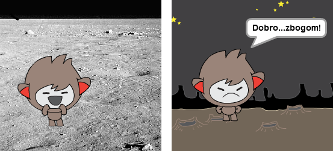
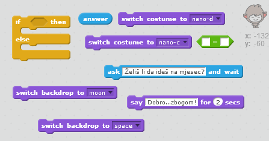
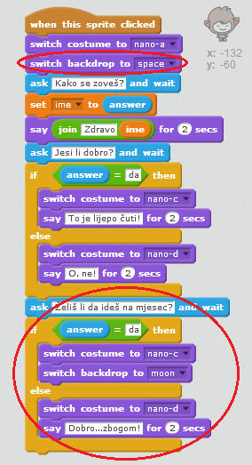
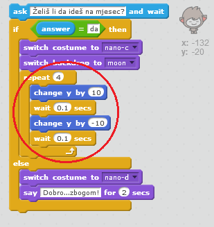

## Promjena lokacije

Svog robota, takođe, možeš da kodiraš da mijenja svoju lokaciju.

--- task ---

Dodaj još jednu pozadinu (backdrop) na svoju Pozornicu, na primjer pozadinu 'moon' (mjesec).

--- /task ---

--- task ---

Da li možeš da kodiraš svog robota da pita "Želiš li da ideš na mjesec?", a zatim da promijeni lokaciju ako je tvoj odgovor "da"?

Isprobaj i sačuvaj. Ako odgovoriš "da", robot treba da promijeni lokaciju. Tvoj robot treba da izgleda tužan i da kaže "Dobro...zbogom!" ukoliko daš bilo koji drugi odgovor.

--- hints --- --- hint --- Tvoj robot treba da **pita** (ask) "Želiš li da ideš na mjesec?". **Ako je** (if) tvoj **odgovor** (answer) "da", robot treba da **promijeni kostim** (change costume) tako da izgleda srećan. Takođe, **pozadina** (backdrop) pozornice treba da se promijeni.

Ako odgovoriš "ne", robot treba da **promijeni kostim** (change costume) tako da izgleda tužan i da **kaže** (say) "Dobro...zbogom!"

Takođe, treba da dodaš kôd da tvoj robot bude na početnom mjestu **kada klikneš na njega** (when clicked). --- /hint --- --- hint --- Ovdje su blokovi kôda koji će ti biti potrebni:  --- /hint --- --- hint --- Ovako bi trebalo da izgleda tvoj kôd:  --- /hint --- --- /hints ---

--- /task ---

--- task ---

Da li možeš da dodaš kôd da tvoj robot skače od sreće ako mu kažeš da želiš da ideš na mjesec?

Isprobaj i sačuvaj. Ako je tvoj odgovor "da", robot bi trebalo da skakuće gore-dolje. Robot ne treba da skakuće ako je dat bilo koji drugi odgovor.

--- hints --- --- hint --- Tvoj robot treba da skakuće tako što će malo **promijeniti** (change) svoju **y poziciju**, a zatim se vratiti na početnu poziciju nakon kratkog **čekanja** (wait). Možda ćeš htjeti da ovo **ponoviš** (repeat) nekoliko puta. --- /hint --- --- hint --- Ovdje su blokovi kôda koji će ti biti potrebni:  --- /hint --- --- hint --- Ovako bi trebalo da izgleda tvoj kôd:  --- /hint --- --- /hints ---

--- /task ---