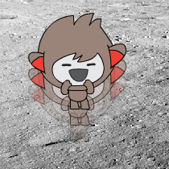

## സ്ഥാനം മാറ്റുന്നു

നിങ്ങൾക്ക് അതിന്റെ ചാറ്റ് ബോട്ട് അതിന്റെ ലൊക്കേഷൻ മാറ്റാൻ കഴിയും.

+ നിങ്ങളുടെ ഘട്ടത്തിൽ മറ്റൊരു ബാക്ക്ഡ്രോപ്പ് ചേർക്കുക, ഉദാഹരണത്തിന് 'ചന്ദ്രൻ' ബാക്ക്ഡ്രോപ്പ്.
    
    

+ "നിങ്ങൾ ചന്ദ്രനിലേക്ക് പോകാൻ താല്പര്യപ്പെടുന്നോ?" എന്ന് ചോദിക്കാൻ നിങ്ങളുടെ ചാറ്റ്ബോട്ട് കോഡ് ചെയ്യാൻ കഴിയുമോ? നിങ്ങൾ "അതെ" എന്ന് മറുപടി നൽകിയാൽ സ്ഥലം മാറ്റണമോ?
    
    പരിശോധിക്കുകയും സംരക്ഷിക്കുകയും ചെയ്യുക. നിങ്ങൾ "അതെ" എന്ന് ഉത്തരം നൽകുകയാണെങ്കിൽ, നിങ്ങളുടെ ചാറ്റ്ബോട്ട് ലൊക്കേഷൻ മാറ്റേണ്ടതുണ്ട്. നിങ്ങളുടെ ചാറ്റ് ബോട്ട് സങ്കടകരമെന്നു പറയട്ടെ "ഓകെ ... ബൈ!" മറ്റേതെങ്കിലും ഉത്തരവും നൽകിയിട്ടുണ്ടെങ്കിൽ.
    
    

\--- സൂചനകൾ \--- \--- സൂചന \--- നിങ്ങളുടെ ചാറ്റ് ബോട്ട് **** ചോദിക്കണം "നിങ്ങൾ ചന്ദ്രനിലേക്ക് പോകാൻ ആഗ്രഹിക്കുന്നുവോ?". **** നിങ്ങളുടെ **ഉത്തരം** "അതെ" ആണെങ്കിൽ, നിങ്ങളുടെ ചാറ്റ് ബോട്ടിന് **വസ്ത്രങ്ങൾ** മാറ്റം സന്തുഷ്ടമായി കാണുകയും, ഘട്ടം **ബാക്ക്ട്രോപ്പ്** മാറ്റുകയും വേണം.

നിങ്ങൾ "ഇല്ല" എന്ന് ഉത്തരം നൽകുകയാണെങ്കിൽ, ചാറ്റ്ബോട്ടിന് **വ്യഞ്ജനം** വ്യതിചലനത്തിനായി വ്യതിചലിപ്പിക്കുന്നു, **** "OK ... ബൈ!"

</strong> ക്ലിക്കുചെയ്യുമ്പോൾ **എന്ന സ്ഥലത്ത് നിങ്ങളുടെ ചാറ്റ്ബോട്ട് ആരംഭിക്കാൻ കോഡ് ചേർക്കേണ്ടതുണ്ട്. \--- / hint \--- \--- സൂചന \--- നിങ്ങൾ ഉപയോഗിക്കുന്ന കോഡ് ബ്ലോക്കുകൾ ഇതാ:  \--- / സൂചന \--- \--- സൂചന \--- ഇവിടെ നിങ്ങളുടെ കോഡ് എങ്ങനെ നോക്കണം:  \--- / സൂചന \--- \--- / / സൂചനകൾ \---
 

+ ചന്ദ്രനിലേക്ക് പോകാൻ നിങ്ങൾ ആഗ്രഹിക്കുന്നുവെങ്കിൽ, നിങ്ങളുടെ ചാറ്റ്ബോട്ട് ജമ്പ് സന്തോഷത്തിന് വേണ്ടി കോഡ് ചേർക്കാൻ കഴിയുമോ?
    
    പരിശോധിക്കുകയും സംരക്ഷിക്കുകയും ചെയ്യുക. നിങ്ങൾ "അതെ" എന്ന് ഉത്തരം നൽകുകയാണെങ്കിൽ, നിങ്ങളുടെ ചാറ്റ്ബോട്ട് മുകളിലേയ്ക്കും താഴേയ്ക്കും പോകണം. മറ്റേതെങ്കിലും ഉത്തരവും നൽകിയിട്ടുണ്ടെങ്കിൽ നിങ്ങളുടെ ചാറ്റ് ബോട്ട് ജമ്പ് പാടില്ല.
    
    

\--- hints \--- \--- hint \--- Your chatbot should jump by **changing** its **y position** by a small amount, and then changing its position back after a short **wait**. നിങ്ങൾ ഇത് **ആവർത്തിക്കുന്നു** ഇത് കുറച്ച് സമയമായി. \--- / hint \--- \--- സൂചന \--- നിങ്ങൾ ഉപയോഗിക്കുന്ന കോഡ് ബ്ലോക്കുകൾ ഇതാ:  \--- / സൂചന \--- \--- സൂചന \--- ഇവിടെ നിങ്ങളുടെ കോഡ് എങ്ങനെ നോക്കണം:  \--- / സൂചന \--- \--- / / സൂചനകൾ \---