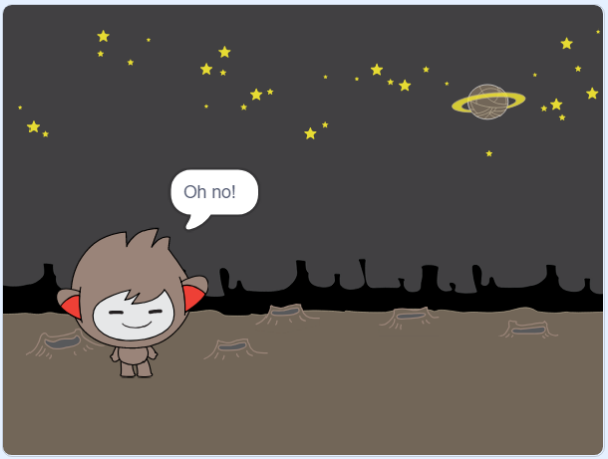

## निर्णय घेणे

आपल्या चॅटबॉटला आपण प्राप्त झालेल्या प्रश्नांवर आधारित काय करावे हे ठरविण्यासाठी प्रोग्राम करू शकता.

प्रथम, आपण आपल्या चॅटबॉटला एक प्रश्न विचारू शकाल ज्याचे उत्तर "होय" किंवा "नाही" असेल.

\--- कार्य \---

आपल्या चॅटबॉटचा कोड बदला. आपल्या चॅटबोॉटने `नाव`{: class = "block3variables"} वेरियेबल वापरून "आपण ओके नेम आहात" प्रश्न विचारला पाहिजे. मग तो "ऐकणे छान आहे" प्रत्युत्तर दिले पाहिजे! `जर`{: class = "block3control"} त्याला मिळालेला उत्तर "होय" आहे, परंतु उत्तर "नाही" असल्यास काहीही बोलायचे नाही.


```blocks3
या परी क्लिक केले तेव्हा
[आपले नाव काय आहे?] विचारू आणि प्रतीक्षा
संच [नाव v] (उत्तर) पर्यंत
म्हणा (सामील [हाय] (नाव)) (2) सेकंद
+ विचारू (सामील [ठीक आहे] (नाव)) आणि प्रतीक्षा
+ तर <(उत्तर) = [yes]> नंतर 
  (2) सेकंद [सांग महान आहे!] म्हणू
शेवट
```

तुमची नवीन कोड चाचणी करण्यासाठी, आपण तपासणी करा **दोनदा**: एकदा उत्तर "होय", आणि एकदा उत्तर "नाही".

\--- / कार्य \---

या क्षणी, आपले चॅटबॉट उत्तर "नाही" वर काहीही म्हणत नाही.

\--- कार्य \---

आपल्या चॅटबॉटचा कोड बदला जेणेकरुन ते "अरे नाही!" जर "आपण ओके नेम आहात" याचे उत्तर म्हणून "नाही" प्राप्त होते.

`असल्यास, नंतर`{: class = "block3control"} `, तर`{: class = "block3control"} ब्लॉक करा आणि कोड समाविष्ट करा जेणेकरुन चॅटबॉट `"अरे नाही!" असे म्हणू शकेल.`{: वर्ग = "ब्लॉक 3looks"}.


```blocks3
जेव्हा हे स्पिट
क्लिक केले [आपले नाव काय आहे?] आणि
सेट [नाव व्ही] ते (उत्तर)
म्हणा ((हाय) (नाव) सामील व्हा (2) सेकंदात
विचारा (सामील व्हा [आपण ठीक आहात] ( नाव) आणि प्रतीक्षा करा

+ <(उत्तर) = [yes]> नंतर 
  म्हणा [ते ऐकणे चांगले आहे!] साठी (2) सेकंद
 
+ म्हणू [अरे नाही!] (2) सेकंद
अंत
```

\--- / कार्य \---

\--- कार्य \---

आपला कोड तपासा. जेव्हा आपण "नाही" उत्तर देता तेव्हा आपल्याला वेगळा प्रतिसाद मिळणे आवश्यक आहे आणि जेव्हा आपण "होय" उत्तर देता तेव्हा: आपल्या चॅटबोॉटला "ऐकणे छान आहे" सह प्रत्युत्तर द्यावे! जेव्हा आपण "होय" उत्तर द्या (जे केस-संवेदनशील नसते) आणि "अरे नाही!" सह प्रत्युत्तर द्या. आपण उत्तर तेव्हा **दुसरे काहीही**.




\--- / कार्य \---

आपण कोणताही कोड `आत ठेवू शकता तर, अन्यथा`{: class = "block3control"} ब्लॉक करा, आपला चॅटबोट बोलण्यासाठी फक्त कोडच नाही!

आपण आपल्या चॅटबोॉटच्या **कॉस्ट्युम्स** टॅबवर क्लिक केल्यास, आपल्याला एकापेक्षा अधिक पोशाख आढळतील.


\--- कार्य \---

आपल्या चॅटबॉटचा कोड बदला जेणेकरुन जेव्हा आपण आपले उत्तर टाइप कराल तेव्हा चॅटबोट पोशाख बदलेल.


`मधील कोड बदलल्यास, अन्यथा`{: class = "block3control"} `स्विच कॉस्च्यूम`अवरोधित करा {{class = "block3looks"}.


```blocks3
जेव्हा हे स्पिट
क्लिक केले [आपले नाव काय आहे?] आणि
सेट [नाव व्ही] ते (उत्तर)
म्हणा ((हाय) (नाव) सामील व्हा (2) सेकंदात
विचारा (सामील व्हा [आपण ठीक आहात] ( नाव)) आणि प्रतीक्षा
तर <(उत्तर) = [yes]> नंतर 

+ (नॅनो-सी v) पर्यंत पोशाख स्विच
  [सांग महान आहे!] म्हणतात (2) सेकंद
इतर 
+ वर पोशाख स्विच (nano- डी व्ही)
  म्हणू [अरे नाही!] (2) सेकंद
अंत
```

आपला कोड तपासा आणि जतन करा. आपल्या उत्तरानुसार आपण आपल्या चॅटबॉट चे चेहरे बदलणे आवश्यक आहे.

\--- / कार्य \---

आपल्या लक्षात आले आहे की, आपल्या चॅटबोॉटच्या पोशाख बदलल्यानंतर, ते असेच राहते आणि सुरुवातीला जे काही होते ते बदलत नाही?

आपण हे वापरून पाहू शकता: आपला कोड चालवा आणि "नाही" याचे उत्तर द्या जेणेकरून आपल्या चॅटबॉटचे चेहरे दुःखदायक स्वरूपात बदलतील. नंतर आपला कोड पुन्हा चालवा आणि लक्षात ठेवा की आपले नाव विचारण्याआधी आपले चॅटबॉट आनंदी दिसण्यात परत येत नाही.


\--- कार्य \---

या समस्येचे निराकरण करण्यासाठी, chatbot कोड जोडू `स्विच पोशाख`{वर्ग = "block3looks"} सुरू `परी क्लिक केली जाते तेव्हा`{वर्ग = "block3events"}.


```blocks3
जेव्हा हे स्पिट

+ स्विच कॉस्च्यूम (नॅनो-ए व्ही) वर क्लिक करते
[आपले नाव काय आहे?] आणि प्रतीक्षा करा
```


\--- / कार्य \---